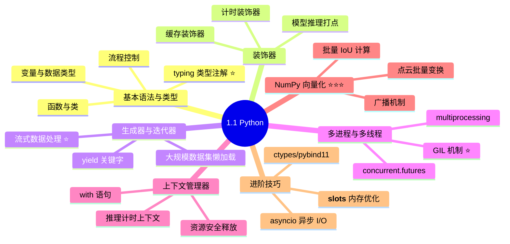
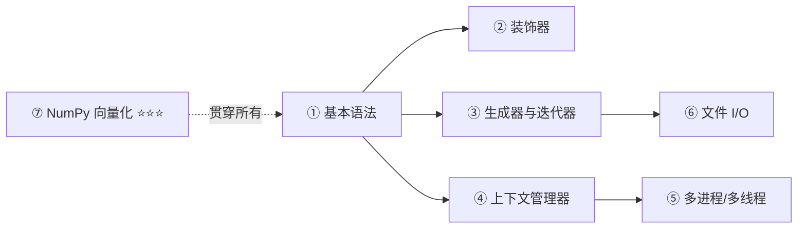

# 1.1 Python — 核心语言 ⭐⭐⭐

> **与机器人视觉感知的关联**：Python 是机器人视觉算法**开发验证的首选语言**。从数据预处理（图像/点云）→ 模型训练（PyTorch）→ 后处理（检测解析/跟踪关联）→ 可视化调试，几乎全链路都离不开 Python。20K 岗位要求"能独立开发维护感知模块"，本质是要求**写出能上机器人稳定运行的 Python 代码**。

---

## 为什么 Python 对机器人视觉如此重要？

| 场景 | 涉及的 Python 知识 | 不理解的后果 |
|------|-------------------|-------------|
| 用 YOLO 做实时检测推理 | 多线程、队列、上下文管理 | 推理卡顿、内存泄漏 |
| 处理万帧视频数据集 | 生成器、迭代器、`yield` | 内存溢出、加载极慢 |
| 多传感器数据同步 | `asyncio`、回调、时间戳对齐 | 数据不同步、融合结果错误 |
| 模型训练与调参 | 装饰器（计时/缓存）、`logging` | 训练脚本混乱、不可复现 |
| 配置文件管理 | `yaml`/`json` 读写、`dataclass` | 配置散落各处、难维护 |
| 部署推理服务 | `ctypes`/`pybind11` 调用 C++ 推理库 | Python 端无法调用 TensorRT |

---

## 学习路径

---

## 掌握程度目标

| 知识点 | 掌握程度 | 说明 |
|--------|---------|------|
| **基本语法** | ⭐⭐⭐ | 变量/流程控制/函数/类，能独立写完整的训练脚本 |
| **装饰器** | ⭐⭐ | 能写带参数的装饰器，理解 `@wraps` |
| **生成器与迭代器** | ⭐⭐⭐ | **核心**：流式处理视频帧，`yield` 用法 |
| **上下文管理器** | ⭐⭐ | 自定义 `__enter__`/`__exit__`，用于资源管理 |
| **多进程/多线程** | ⭐⭐⭐ | **核心**：GIL 理解、多路视频并行处理 |
| **类型注解** | ⭐⭐ | `typing` 模块常用类型 |
| **文件 I/O** | ⭐⭐⭐ | `json/yaml/protobuf` 序列化 |
| **NumPy 向量化** | ⭐⭐⭐ | **核心**：广播、批量 IoU、点云变换 |
| **ctypes/pybind11** | ⭐⭐ | Python ↔ C++ 互调接口 |
| **asyncio** | ⭐ | 多传感器异步 I/O |

---

## 内容目录

| 子专题 | 链接 |
|--------|------|
| 1.1.1 基本语法与类型注解 | [→](./1.1.1_基本语法与类型注解.md) |
| 1.1.2 装饰器与上下文管理器 | [→](./1.1.2_装饰器与上下文管理器.md) |
| 1.1.3 生成器与迭代器 | [→](./1.1.3_生成器与迭代器.md) |
| 1.1.4 多进程与多线程 | [→](./1.1.4_多进程与多线程.md) |
| 1.1.5 文件 I/O 与异常处理 | [→](./1.1.5_文件IO与异常处理.md) |
| 1.1.6 进阶技巧（NumPy/ctypes/asyncio） | [→](./1.1.6_进阶技巧.md) |

---

## 推荐学习资源

| 类型 | 资源 | 用途 |
|------|------|------|
| **教程** | Python 官方教程 (docs.python.org) | 基础语法速通 |
| **练习** | NumPy 100 题 (GitHub) | 向量化编程入门 |
| **实战** | 自己写一个 YOLO 推理脚本 | 综合应用所有知识 |
| **进阶** | Fluent Python (《流畅的 Python》) | 深入理解 Python 特性 |
