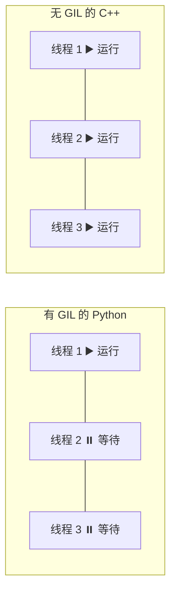

# 1.1.4 多进程与多线程

> **机器人视觉定位**：实时视觉系统需要同时处理**多路摄像头输入**、**模型推理**、**结果可视化**——这些任务必须并行执行。理解 GIL、多线程（I/O 密集）和多进程（CPU 密集）的区别，是写出实时系统的前提。

---

## 1. GIL 机制 ⭐⭐⭐

**GIL（Global Interpreter Lock）**：Python 解释器全局锁，同一时刻只有一个线程执行 Python 字节码。



| 场景 | 适合多线程？ | 适合多进程？ | 原因 |
|------|:----------:|:----------:|------|
| **I/O 密集型**（读文件/网络请求/数据库） | ✅ | ✅ | 线程等待 I/O 时释放 GIL |
| **CPU 密集型**（图像处理/循环计算） | ❌ | ✅ | 线程被 GIL 限制，多进程可并行 |
| **模型推理**（PyTorch/TensorRT） | ⚠️ 部分可 | ✅ | 推理库内部释放 GIL |
| **多路视频流读取** | ✅ | ✅ | I/O 等待为主 |

---

## 2. 多线程：I/O 密集型任务

### 2.1 `concurrent.futures.ThreadPoolExecutor`

```python
import cv2
import numpy as np
from concurrent.futures import ThreadPoolExecutor, as_completed
import time

def read_frame(video_path: str, frame_idx: int):
    """读取指定帧（I/O 操作，适合多线程）"""
    cap = cv2.VideoCapture(video_path)
    cap.set(cv2.CAP_PROP_POS_FRAMES, frame_idx)
    ret, frame = cap.read()
    cap.release()
    return frame_idx, frame if ret else None

# 多线程读取多帧
video_path = "highway.mp4"
frame_indices = [0, 100, 200, 300, 400]

with ThreadPoolExecutor(max_workers=4) as executor:
    # 提交所有任务
    futures = {
        executor.submit(read_frame, video_path, idx): idx
        for idx in frame_indices
    }
    # 逐个获取结果
    for future in as_completed(futures):
        idx, frame = future.result()
        if frame is not None:
            print(f"成功读取第 {idx} 帧，shape={frame.shape}")
```

### 2.2 多路摄像头实时读取

```python
import threading
import queue

class CameraStream:
    """独立线程读取摄像头——不阻塞主线程"""
    def __init__(self, cam_id: int, buffer_size: int = 2):
        self.cap = cv2.VideoCapture(cam_id)
        self.q = queue.Queue(maxsize=buffer_size)
        self.running = True
        self.thread = threading.Thread(target=self._read_loop, daemon=True)
        self.thread.start()
    
    def _read_loop(self):
        """后台线程持续读取"""
        while self.running:
            ret, frame = self.cap.read()
            if not ret:
                break
            if not self.q.full():
                self.q.put(frame)
    
    def read(self):
        """主线程调用——返回最新帧（不阻塞）"""
        return self.q.get() if not self.q.empty() else None
    
    def release(self):
        self.running = False
        self.thread.join()
        self.cap.release()

# 使用：两路摄像头并行读取
cam1 = CameraStream(0)
cam2 = CameraStream(1)

while True:
    frame1 = cam1.read()
    frame2 = cam2.read()
    if frame1 is not None and frame2 is not None:
        # 两路帧都已就绪，做双目处理
        combined = np.hstack([frame1, frame2])
        cv2.imshow("Dual Cameras", combined)
    if cv2.waitKey(1) & 0xFF == ord('q'):
        break

cam1.release()
cam2.release()
cv2.destroyAllWindows()
```

---

## 3. 多进程：CPU 密集型任务

### 3.1 `concurrent.futures.ProcessPoolExecutor`

```python
from concurrent.futures import ProcessPoolExecutor
import numpy as np

def process_batch(image_batch: np.ndarray):
    """CPU 密集型：图像预处理（多进程并行）"""
    # 模拟耗时计算
    result = []
    for img in image_batch:
        # 高斯模糊 + 边缘检测
        blurred = cv2.GaussianBlur(img, (5, 5), 1.0)
        edges = cv2.Canny(blurred, 50, 150)
        result.append(edges)
    return np.array(result)

# 将 100 张图分到 4 个进程处理
images = [np.random.randint(0, 255, (480, 640, 3), dtype=np.uint8) for _ in range(100)]
batch_size = 25
batches = [images[i:i+batch_size] for i in range(0, 100, batch_size)]

with ProcessPoolExecutor(max_workers=4) as executor:
    results = list(executor.map(process_batch, batches))

print(f"处理完成，共 {sum(len(r) for r in results)} 张图")
```

### 3.2 多进程 + 多线程组合

```python
# 推荐方案：多进程处理 CPU 任务 + 多线程处理 I/O 任务
# 例如：用 4 个进程做推理，每个进程内用 2 个线程读数据
```

---

## 4. 多进程间通信

```python
import multiprocessing as mp
import numpy as np

def worker(shared_array: np.ndarray, idx: int):
    """子进程修改共享数组"""
    shared_array[idx] = idx * 2

# 使用共享内存
shared = mp.Array('d', 10)  # 共享 double 数组
processes = []

for i in range(10):
    p = mp.Process(target=worker, args=(shared, i))
    processes.append(p)
    p.start()

for p in processes:
    p.join()

print(list(shared))  # [0.0, 2.0, 4.0, ...]
```

---

## 面试常问

> **GIL 对视觉项目有什么实际影响？**

```
- 纯 Python 循环做图像处理 → 多线程无加速 → 用多进程
- 模型推理（PyTorch/TensorRT） → 推理库内部释放 GIL → 多线程有效
- 多路摄像头读取 → I/O 密集型 → 多线程即可
- 最佳实践：多进程（CPU）+ 多线程（I/O）组合使用
```

---

## 必须掌握的要点

1. **GIL 存在性**：知道什么时候用多线程、什么时候用多进程
2. **`ThreadPoolExecutor`**：多路视频流并行读取的标准写法
3. **`ProcessPoolExecutor`**：批量图像处理的标准写法
4. **生产者-消费者模式**：后台线程读帧 + 主线程推理

---

[← 返回 1.1.0 总览与学习路径](1.1.0_总览与学习路径.md)

---

## 📝 测试题

**1. 本质理解** ⭐⭐⭐
GIL（全局解释器锁）是什么？为什么说"Python 多线程在 CPU 密集型任务中无效"？这个论断对视觉项目有什么实际影响？

**2. 代码实践** ⭐⭐⭐
实现一个多线程摄像头读取类 `CameraStream`：独立线程持续读取摄像头帧，主线程通过 `read()` 获取最新帧。要求使用 `queue.Queue` 做缓冲，避免主线程被 I/O 阻塞。

**3. 视觉关联** ⭐⭐
在实时视觉系统中，为什么通常使用"多进程处理推理 + 多线程处理 I/O"的组合方案？各解决什么问题？
