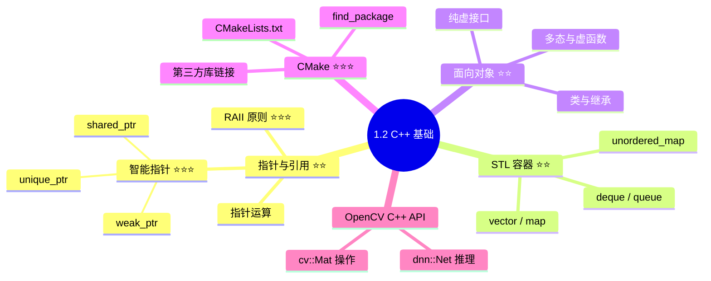

# 1.2 C++ 基础 — 部署与集成 ⭐⭐

> **与机器人视觉感知的关联**：Python 是开发原型，C++ 是**上线部署**。TensorRT 推理引擎、ROS 节点、嵌入式端（Jetson）的核心代码都是 C++。20K 岗位不要求你成为 C++ 专家，但必须能**看懂和修改**现有 C++ 推理代码，能写简单的 ROS C++ 节点。

---

## 为什么机器人视觉需要 C++？

| 场景 | 涉及的 C++ 知识 | 不理解的后果 |
|------|----------------|-------------|
| TensorRT 引擎加载与推理 | 智能指针、RAII | 内存泄漏、引擎管理混乱 |
| ROS 感知节点编写 | CMake、类/继承 | 无法集成到机器人系统 |
| 性能关键预处理 | OpenCV C++ API、`cv::Mat` | Python 预处理速度跟不上 |
| 嵌入式部署（Jetson） | 指针、内存管理 | 部署经常崩溃 |

---

## 学习路径



---

## 1. 指针与引用 ⭐⭐

### 1.1 基础对比

| 特性 | 指针 | 引用 |
|------|------|------|
| 语法 | `int* p = &a` | `int& r = a` |
| 可重新绑定 | ✅ 可指向其他变量 | ❌ 初始化后不可变 |
| 空值 | ✅ 可为 nullptr | ❌ 必须初始化 |
| 用途 | 可选参数、动态内存 | 函数参数传递 |

```cpp
// 引用传参——推荐方式（避免拷贝）
void processImage(const cv::Mat& image, cv::Mat& result) {
    // image: 只读引用，不拷贝
    // result: 输出引用
    cv::GaussianBlur(image, result, cv::Size(5, 5), 1.0);
}
```

### 1.2 智能指针 ⭐⭐⭐

```cpp
#include <memory>

// unique_ptr——独占所有权（推荐首选）
auto model = std::make_unique<InferenceEngine>("model.trt");
// 不能拷贝，只能移动
auto model2 = std::move(model);  // model 变为空

// shared_ptr——共享所有权
auto detector = std::make_shared<YOLODetector>("yolov8.pt");
auto detector2 = detector;  // 引用计数 +1

// weak_ptr——弱引用，解决循环引用
std::weak_ptr<Detector> w = detector;
if (auto shared = w.lock()) {  // 检查对象是否仍存在
    shared->detect(frame);
}
```

### 1.3 RAII 原则 ⭐⭐⭐

**RAII（Resource Acquisition Is Initialization）**：资源获取即初始化。

```cpp
class TensorRTEngine {
    // RAII：构造函数获取资源，析构函数自动释放
public:
    TensorRTEngine(const std::string& model_path) {
        // 构造函数：加载模型、分配显存
        runtime_ = nvinfer1::createInferRuntime(logger_);
        engine_ = runtime_->deserializeCudaEngine(model_path);
        context_ = engine_->createExecutionContext();
    }
    
    ~TensorRTEngine() {
        // 析构函数：自动释放所有资源
        context_.reset();
        engine_.reset();
        runtime_.reset();
    }
    
    // 禁止拷贝
    TensorRTEngine(const TensorRTEngine&) = delete;
    TensorRTEngine& operator=(const TensorRTEngine&) = delete;

private:
    std::unique_ptr<nvinfer1::IRuntime> runtime_;
    std::unique_ptr<nvinfer1::ICudaEngine> engine_;
    std::unique_ptr<nvinfer1::IExecutionContext> context_;
};
```

---

## 2. STL 容器 ⭐⭐

| 容器 | 特点 | 视觉用途 |
|------|------|----------|
| `std::vector<T>` | 动态数组，连续内存 | 存储检测框、特征点列表 |
| `std::map<K,V>` | 有序键值对（红黑树） | ID→跟踪目标映射 |
| `std::unordered_map<K,V>` | 哈希表（O(1) 查找） | 快速 ID 查找 |
| `std::queue<T>` | 队列（FIFO） | 帧缓冲、消息队列 |

```cpp
#include <vector>
#include <map>

// 检测结果结构体
struct Detection {
    float x1, y1, x2, y2;  // 边界框
    float score;             // 置信度
    int label;               // 类别
};

// 使用 vector 存储检测结果（连续内存，cache friendly）
std::vector<Detection> detections;
detections.push_back({100, 200, 300, 400, 0.95, 0});

// 使用 unordered_map 按 ID 管理跟踪目标
std::unordered_map<int, Detection> tracked_objects;
tracked_objects[1] = {/*...*/};

// 查找
auto it = tracked_objects.find(1);
if (it != tracked_objects.end()) {
    // 找到目标 ID=1
}
```

---

## 3. 面向对象 ⭐⭐

### 3.1 纯虚接口——算法插件化

```cpp
// 定义抽象接口——所有检测器必须实现
class IDetector {
public:
    virtual ~IDetector() = default;
    virtual std::vector<Detection> detect(const cv::Mat& image) = 0;
    virtual std::string name() const = 0;
};

// YOLO 实现
class YOLODetector : public IDetector {
public:
    YOLODetector(const std::string& model_path) {
        // 加载 YOLO 模型
    }
    
    std::vector<Detection> detect(const cv::Mat& image) override {
        // YOLO 推理逻辑
        return detections;
    }
    
    std::string name() const override {
        return "YOLOv8";
    }

private:
    // 模型成员
};

// 使用——统一接口，可替换任意检测器
std::unique_ptr<IDetector> detector = std::make_unique<YOLODetector>("yolov8.pt");
auto results = detector->detect(image);
```

---

## 4. CMake 工程构建 ⭐⭐⭐

### 4.1 基本 CMakeLists.txt

```cmake
cmake_minimum_required(VERSION 3.16)
project(PerceptionNode)

set(CMAKE_CXX_STANDARD 17)
set(CMAKE_CXX_STANDARD_REQUIRED ON)

# 查找依赖
find_package(OpenCV REQUIRED COMPONENTS core imgproc dnn)
find_package(TensorRT REQUIRED)

# 添加可执行文件
add_executable(detection_node src/main.cpp src/detector.cpp)

# 链接库
target_link_libraries(detection_node
    ${OpenCV_LIBS}
    ${TensorRT_LIBRARIES}
    nvinfer
    cudart
)

# 包含头文件路径
target_include_directories(detection_node PRIVATE
    ${OpenCV_INCLUDE_DIRS}
    ${TensorRT_INCLUDE_DIRS}
)
```

### 4.2 编译命令

```bash
mkdir build && cd build
cmake ..
make -j$(nproc)
./detection_node
```

---

## 必须掌握的要点

1. **智能指针**：`unique_ptr`（独占）和 `shared_ptr`（共享）的使用场景
2. **RAII 原则**：构造函数获取资源、析构函数释放资源——写 TensorRT/CUDA 代码的基石
3. **OpenCV C++ API**：`cv::Mat` 的基本操作（读图/预处理/显示）
4. **CMakeLists.txt**：能看懂并修改 `find_package` 和 `target_link_libraries`
5. **纯虚接口**：能定义可替换的算法接口（插件化设计）

---

[← 返回 一.编程基础 总览](../1.1_Python/1.1.0_总览与学习路径.md)
