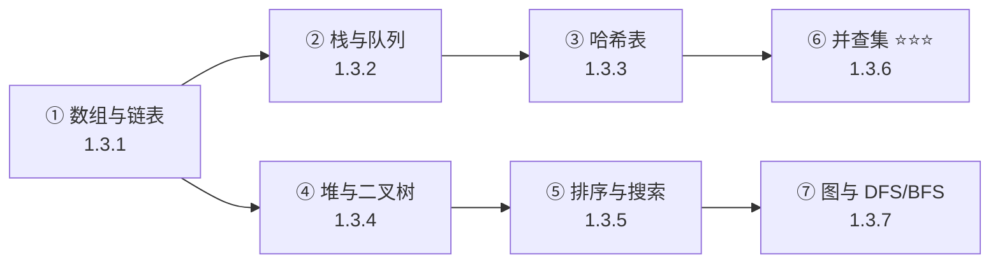

# 1.3 数据结构与算法 ⭐⭐

> **与机器人视觉感知的关联**：数据结构是视觉算法的**载体**。数组存图像、链表管 Tracklet、队列做 NMS、哈希表查目标、并查集聚类点云。LeetCode 中等难度 20 分钟内 AC 是基本要求，但更重要的是**理解每种结构在视觉系统中的实际用途**。

---

## 为什么数据结构对机器人视觉重要？

| 场景 | 涉及的数据结构 | 不理解的后果 |
|------|---------------|-------------|
| 多目标跟踪中的轨迹管理 | 链表、哈希表 | 轨迹增删低效、ID 查找慢 |
| NMS 候选框排序 | 堆/优先队列 | 后处理成为性能瓶颈 |
| 点云欧式聚类 | **并查集** ⭐⭐⭐ | 聚类实现不了 |
| SLAM 共视图遍历 | 图、DFS/BFS | 不理解后端优化流程 |
| 按置信度取 Top-K 检测 | 大/小顶堆 | 手动排序效率低 |
| 图像连通域分析 | DFS、并查集 | 无法实现区域标注 |

---

## 内容目录

| 子专题 | 文件 | 掌握程度 |
|--------|------|:--------:|
| **数组与链表** | [1.3.1 →](1.3.1_数组与链表.md) | ⭐⭐ |
| **栈与队列** | [1.3.2 →](1.3.2_栈与队列.md) | ⭐⭐ |
| **哈希表** | [1.3.3 →](1.3.3_哈希表.md) | ⭐⭐ |
| **二叉树与堆** | [1.3.4 →](1.3.4_二叉树与堆.md) | ⭐⭐ |
| **排序与搜索** | [1.3.5 →](1.3.5_排序与搜索.md) | ⭐⭐ |
| **并查集** ⭐⭐⭐ | [1.3.6 →](1.3.6_并查集.md) | ⭐⭐⭐ |
| **图与 DFS/BFS** | [1.3.7 →](1.3.7_图与DFS_BFS.md) | ⭐⭐ |

---

## 学习路径

---

| 数据结构 | 掌握程度 | LeetCode 要求 |
|----------|---------|---------------|
| 数组与链表 | ⭐⭐ | 反转链表、合并有序链表 |
| 栈与队列 | ⭐⭐ | 有效括号、滑动窗口 |
| 哈希表 | ⭐⭐ | 两数之和、LRU 缓存 |
| 二叉树/堆 | ⭐⭐ | 层序遍历、Top-K |
| 排序/搜索 | ⭐⭐ | 快排、二分搜索 |
| **并查集** | ⭐⭐⭐ | **点云聚类中必须能手写** |
| 图/DFS/BFS | ⭐⭐ | 岛屿数量、连通分量 |

---

## 1. 数组与链表 ⭐⭐

> 详情见 [1.3.1 数组与链表](1.3.1_数组与链表.md)

`std::vector` 是视觉算法中最常用的容器——存检测框、特征点、图像数据。链表用于管理跟踪目标的 Tracklet 生命周期。

## 2. 栈与队列 ⭐⭐

> 详情见 [1.3.2 栈与队列](1.3.2_栈与队列.md)

队列做帧缓冲（FIFO），栈做 DFS（LIFO），优先队列用于 NMS 加速排序。

## 3. 哈希表 ⭐⭐

> 详情见 [1.3.3 哈希表](1.3.3_哈希表.md)

`std::unordered_map` 实现 O(1) 的按 ID 查找，是多目标跟踪目标池的标配。

## 4. 二叉树与堆 ⭐⭐

> 详情见 [1.3.4 二叉树与堆](1.3.4_二叉树与堆.md)

堆（优先队列）实现 Top-K 和 NMS，KD-Tree 加速点云最近邻搜索。

## 5. 排序与搜索 ⭐⭐

> 详情见 [1.3.5 排序与搜索](1.3.5_排序与搜索.md)

排序按置信度筛选框，二分搜索用于参数调优（如 NMS 阈值）。

## 6. 并查集 ⭐⭐⭐

> 详情见 [1.3.6 并查集](1.3.6_并查集.md)

**面试手撕高频**——点云欧式聚类和图像连通域分析的核心算法。

## 7. 图与 DFS/BFS ⭐⭐

> 详情见 [1.3.7 图与 DFS/BFS](1.3.7_图与DFS_BFS.md)

DFS 遍历 SLAM 共视图，BFS 求最短共视路径。

---

## LeetCode 推荐

| 题号 | 题目 | 数据结构 | 视觉关联 |
|:----:|------|----------|----------|
| 206 | 反转链表 | 链表 | Tracklet 反转遍历 |
| 20 | 有效括号 | 栈 | 语法解析类比 |
|:----:|------|----------|----------|
| 206 | 反转链表 | 链表 | Tracklet 反转遍历 |
| 20 | 有效括号 | 栈 | 语法解析类比 |
| 239 | 滑动窗口最大值 | 双端队列 | 滑动窗口 NMS |
| 1 | 两数之和 | 哈希表 | 特征匹配查找 |
| 146 | LRU 缓存 | 哈希表+链表 | 帧缓存淘汰策略 |
| 215 | 数组第 K 大 | 堆 | Top-K 检测 |
| 200 | 岛屿数量 | DFS/并查集 | 连通域分析 |
| 547 | 省份数量 | 并查集 | 点云聚类 |

> **要求**：LeetCode 中等难度 20 分钟内能 AC，Hot 100 至少刷 50 题。

---

## 必须掌握的要点

1. **并查集（Union-Find）**：路径压缩 + 按秩合并——点云聚类和连通域的基础
2. **堆（Heap）**：Top-K 问题和优先队列 NMS
3. **哈希表**：按 ID 快速查找跟踪目标
4. **KD-Tree**：点云最近邻搜索（了解基本原理）
5. **DFS/BFS**：图像连通域分析

---

[← 返回 一.编程基础 总览](../1.1_Python/1.1.0_总览与学习路径.md)

---

## 📝 测试题

**1. 本质理解** ⭐
数据结构在视觉 Pipeline 中扮演什么角色？请举例说明数组、队列、哈希表在视觉系统中的具体对应场景。

**2. 概念辨析** ⭐⭐
并查集在点云聚类中解决的核心问题是什么？如果用暴力方法代替并查集会有什么性能问题？
