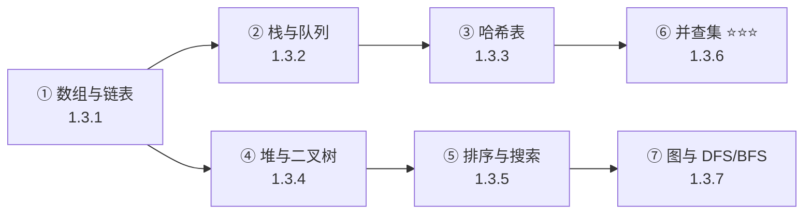

# 1.3 数据结构与算法 ⭐⭐

> **与机器人视觉感知的关联**：数据结构是视觉算法的**载体**。数组存图像、链表管 Tracklet、队列做 NMS、哈希表查目标、并查集聚类点云。LeetCode 中等难度 20 分钟内 AC 是基本要求，但更重要的是**理解每种结构在视觉系统中的实际用途**。

---

## 为什么数据结构对机器人视觉重要？

| 场景 | 涉及的数据结构 | 不理解的后果 |
|------|---------------|-------------|
| 多目标跟踪中的轨迹管理 | 链表、哈希表 | 轨迹增删低效、ID 查找慢 |
| NMS 候选框排序 | 堆/优先队列 | 后处理成为性能瓶颈 |
| 点云欧式聚类 | **并查集** ⭐⭐⭐ | 聚类实现不了 |
| SLAM 共视图遍历 | 图、DFS/BFS | 不理解后端优化流程 |
| 按置信度取 Top-K 检测 | 大/小顶堆 | 手动排序效率低 |
| 图像连通域分析 | DFS、并查集 | 无法实现区域标注 |

---

## 内容目录

| 子专题 | 文件 | 掌握程度 |
|--------|------|:--------:|
| **数组与链表** | [1.3.1 →](1.3.1_数组与链表.md) | ⭐⭐ |
| **栈与队列** | [1.3.2 →](1.3.2_栈与队列.md) | ⭐⭐ |
| **哈希表** | [1.3.3 →](1.3.3_哈希表.md) | ⭐⭐ |
| **二叉树与堆** | [1.3.4 →](1.3.4_二叉树与堆.md) | ⭐⭐ |
| **排序与搜索** | [1.3.5 →](1.3.5_排序与搜索.md) | ⭐⭐ |
| **并查集** ⭐⭐⭐ | [1.3.6 →](1.3.6_并查集.md) | ⭐⭐⭐ |
| **图与 DFS/BFS** | [1.3.7 →](1.3.7_图与DFS_BFS.md) | ⭐⭐ |

---

## 学习路径



---

| 数据结构 | 掌握程度 | LeetCode 要求 |
|----------|---------|---------------|
| 数组与链表 | ⭐⭐ | 反转链表、合并有序链表 |
| 栈与队列 | ⭐⭐ | 有效括号、滑动窗口 |
| 哈希表 | ⭐⭐ | 两数之和、LRU 缓存 |
| 二叉树/堆 | ⭐⭐ | 层序遍历、Top-K |
| 排序/搜索 | ⭐⭐ | 快排、二分搜索 |
| **并查集** | ⭐⭐⭐ | **点云聚类中必须能手写** |
| 图/DFS/BFS | ⭐⭐ | 岛屿数量、连通分量 |

---

## 1. 数组与链表 ⭐⭐

### 1.1 动态数组 std::vector

```python
# Python 中的 list 就是动态数组
detections = []  # 存储检测结果

# 常见操作
detections.append({"label": "car", "score": 0.95})
detections.append({"label": "person", "score": 0.87"})

# 按置信度排序
detections.sort(key=lambda x: x["score"], reverse=True)

# 取 Top-K
top_5 = detections[:5]
```

### 1.2 链表——跟踪目标管理

```python
# 简化版 Tracklet 双向链表节点
class TrackNode:
    def __init__(self, track_id: int):
        self.track_id = track_id
        self.detections = []     # 该目标的检测历史
        self.prev = None         # 前驱节点
        self.next = None         # 后继节点
        self.is_active = True

class TrackList:
    """双向链表管理所有跟踪目标"""
    def __init__(self):
        self.head = None
        self.tail = None
        self.active_count = 0
    
    def add_track(self, track_id: int):
        """添加新跟踪目标到链表末尾"""
        node = TrackNode(track_id)
        if self.tail is None:
            self.head = self.tail = node
        else:
            self.tail.next = node
            node.prev = self.tail
            self.tail = node
        self.active_count += 1
    
    def remove_track(self, track_id: int):
        """删除丢失的跟踪目标——O(1) 操作"""
        # 实际中通过哈希表快速定位节点
        pass
```

---

## 2. 栈与队列 ⭐⭐

### 2.1 优先队列——NMS 候选框排序

```python
import heapq

def nms_with_heap(detections, iou_thresh=0.5):
    """
    用最大堆实现 NMS——每次都取置信度最高的框
    detections: [(x1, y1, x2, y2, score), ...]
    """
    # Python 的 heapq 是最小堆，取负值模拟最大堆
    heap = [(-score, x1, y1, x2, y2) for x1, y1, x2, y2, score in detections]
    heapq.heapify(heap)
    
    keep = []
    while heap:
        _, *box = heapq.heappop(heap)  # 取置信度最高的框
        keep.append(box)
        
        # 移除与当前框 IoU 过高的候选
        heap = [item for item in heap 
                if compute_iou(box, item[1:]) < iou_thresh]
        heapq.heapify(heap)
    
    return keep
```

### 2.2 队列——帧缓冲

```python
from collections import deque

# 滑动窗口存储最近 N 帧
frame_buffer = deque(maxlen=30)  # 存储最近 30 帧

# 不断添加新帧，自动移除最老的帧
for frame in video_stream:
    frame_buffer.append(frame)
    # frame_buffer 始终保持最近 30 帧
```

---

## 3. 哈希表 ⭐⭐

### 3.1 按 ID 快速查找跟踪目标

```python
# 用字典（哈希表）管理跟踪目标——O(1) 查找
tracked_objects: dict[int, dict] = {}

# 添加目标
tracked_objects[1] = {"bbox": (100, 200, 300, 400), "score": 0.95}
tracked_objects[2] = {"bbox": (150, 250, 350, 450), "score": 0.87}

# 更新目标
if 1 in tracked_objects:
    tracked_objects[1]["bbox"] = new_bbox

# 删除丢失目标
del tracked_objects[2]
```

---

## 4. 二叉树与堆 ⭐⭐

### 4.1 堆——Top-K 检测

```python
import heapq

def top_k_detections(detections, k=5):
    """用最小堆取 Top-K 个最高置信度检测"""
    heap = []
    for det in detections:
        heapq.heappush(heap, (det["score"], det))
        if len(heap) > k:
            heapq.heappop(heap)  # 弹出最小的
    # 堆中剩下的就是 Top-K
    return [item[1] for item in heap]
```

### 4.2 KD-Tree——点云最近邻搜索（选学）

```python
from scipy.spatial import KDTree

# 点云配准中寻找最近邻
source_points = np.random.randn(1000, 3)  # 源点云
target_tree = KDTree(source_points)        # 构建 KD-Tree

# 查询最近邻——O(log n)
query_point = np.array([0.1, 0.2, 0.3])
dist, idx = target_tree.query(query_point)
print(f"最近点索引: {idx}, 距离: {dist:.4f}")

# 批量查询
dists, indices = target_tree.query(source_points, k=5)  # 每个点找 5 个最近邻
```

---

## 5. 并查集 Union-Find ⭐⭐⭐

并查集是面试手撕高频题，在点云聚类和图像连通域分析中都会用到。

```python
class UnionFind:
    """并查集——带路径压缩和按秩合并"""
    def __init__(self, n: int):
        self.parent = list(range(n))
        self.rank = [0] * n
    
    def find(self, x: int) -> int:
        """查找根节点（路径压缩）"""
        if self.parent[x] != x:
            self.parent[x] = self.find(self.parent[x])
        return self.parent[x]
    
    def union(self, x: int, y: int):
        """合并两个集合（按秩合并）"""
        px, py = self.find(x), self.find(y)
        if px == py:
            return
        if self.rank[px] < self.rank[py]:
            self.parent[px] = py
        elif self.rank[px] > self.rank[py]:
            self.parent[py] = px
        else:
            self.parent[py] = px
            self.rank[px] += 1

# 点云欧式聚类
def euclidean_clustering(points, radius=0.5):
    """基于欧氏距离的点云聚类"""
    n = len(points)
    uf = UnionFind(n)
    
    for i in range(n):
        for j in range(i + 1, n):
            dist = np.linalg.norm(points[i] - points[j])
            if dist < radius:
                uf.union(i, j)
    
    # 收集聚类结果
    clusters = {}
    for i in range(n):
        root = uf.find(i)
        if root not in clusters:
            clusters[root] = []
        clusters[root].append(i)
    
    return list(clusters.values())

# 使用
points = np.random.randn(100, 3)  # 100 个点
clusters = euclidean_clustering(points, radius=0.8)
print(f"聚类数量: {len(clusters)}")
```

---

## 6. LeetCode 重点推荐

| 题号 | 题目 | 数据结构 | 视觉关联 |
|:----:|------|----------|----------|
| 206 | 反转链表 | 链表 | Tracklet 反转遍历 |
| 20 | 有效括号 | 栈 | 语法解析类比 |
| 239 | 滑动窗口最大值 | 双端队列 | 滑动窗口 NMS |
| 1 | 两数之和 | 哈希表 | 特征匹配查找 |
| 146 | LRU 缓存 | 哈希表+链表 | 帧缓存淘汰策略 |
| 215 | 数组第 K 大 | 堆 | Top-K 检测 |
| 200 | 岛屿数量 | DFS/并查集 | 连通域分析 |
| 547 | 省份数量 | 并查集 | 点云聚类 |

> **要求**：LeetCode 中等难度 20 分钟内能 AC，Hot 100 至少刷 50 题。

---

## 必须掌握的要点

1. **并查集（Union-Find）**：路径压缩 + 按秩合并——点云聚类和连通域的基础
2. **堆（Heap）**：Top-K 问题和优先队列 NMS
3. **哈希表**：按 ID 快速查找跟踪目标
4. **KD-Tree**：点云最近邻搜索（了解基本原理）
5. **DFS/BFS**：图像连通域分析

---

[← 返回 一.编程基础 总览](../1.1_Python/1.1.0_总览与学习路径.md)

---

## 📝 测试题

**1. 本质理解** ⭐
数据结构在视觉 Pipeline 中扮演什么角色？请举例说明数组、队列、哈希表在视觉系统中的具体对应场景。

**2. 概念辨析** ⭐⭐
并查集在点云聚类中解决的核心问题是什么？如果用暴力方法代替并查集会有什么性能问题？
