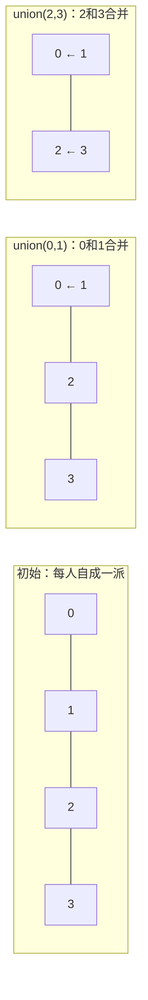

# 1.3.2 并查集、图与排序搜索 ⭐⭐⭐

> **机器人视觉定位**：**并查集（Union-Find）** 是点云欧式聚类和图像连通域分析的标准算法——面试手撕高频题、工程中天天用。**DFS/BFS** 遍历 SLAM 共视图、**排序**按置信度筛选检测框——这些算法构成了视觉后处理的基础设施。

---

## 1. 并查集 Union-Find ⭐⭐⭐

### 1.1 本质：快速回答两个问题

并查集不关心集合里具体有什么，它只回答两个问题：

1. **你俩是一伙的吗？** → `find(a) == find(b)`
2. **你俩合并成一伙。** → `union(a, b)`

> **一句话本质**：并查集 = 一种专门管理"分组"的结构，核心就两个操作——**查（find）**：找组长；**并（union）**：两组合并。时间复杂度近乎 O(1)，比你想的任何一个常数时间操作都快。



---

### 1.2 标准实现——逐行拆解（必须能手写）

```python
class UnionFind:
    """
    并查集——带两个优化：路径压缩 + 按秩合并
    
    一句话记忆：find 找根顺便压平，union 矮树挂高树。
    有了这两个优化，每次操作的时间 ≈ O(1)
    """
    def __init__(self, n: int):
        # parent[i] 表示元素 i 的父节点
        # 初始时，每个元素的父节点指向自己（自成一派）
        self.parent = list(range(n))
        
        # rank[i] 表示以 i 为根的树的"大致高度"（秩）
        # 初始所有树高度为 0
        self.rank = [0] * n
    
    def find(self, x: int) -> int:
        """
        查找 x 所属的根节点（即组长是谁）
        
        关键优化——路径压缩：
        在查找过程中，把路径上碰到的所有节点
        直接挂到根节点下面，下次查找就是 O(1)
        """
        # 递归基：如果 x 的父节点就是自己，说明 x 是根
        if self.parent[x] != x:
            # 递归向上找根，同时把路径上的节点直接挂到根下
            self.parent[x] = self.find(self.parent[x])
        return self.parent[x]
    
    def union(self, x: int, y: int):
        """
        合并 x 和 y 所在的两个集合
        
        关键优化——按秩合并：
        把"矮"的树挂到"高"的树下面，保证树不会越长越高
        这样 find 的递归深度始终可控
        """
        px = self.find(x)  # 找到 x 的根
        py = self.find(y)  # 找到 y 的根
        
        if px == py:
            return          # 已经在同一个集合里，无需合并
        
        # 把矮的树挂在高的树下（rank 小的挂在 rank 大的下面）
        if self.rank[px] < self.rank[py]:
            self.parent[px] = py   # px 的根指向 py
        elif self.rank[px] > self.rank[py]:
            self.parent[py] = px   # py 的根指向 px
        else:
            # 高度相同，随便挂一个，挂完后高度 +1
            self.parent[py] = px
            self.rank[px] += 1
    
    def connected(self, x: int, y: int) -> bool:
        """判断 x 和 y 是否连通——本质就是看根是否相同"""
        return self.find(x) == self.find(y)
```

**代码拆解——为什么这样写？**

```
__init__:
  - parent = list(range(n))：每个元素初始的"组长"是自己
  - rank = [0] * n：初始每棵树高度为 0
  
find:
  - if self.parent[x] != x：只要不是根，就往上找
  - self.parent[x] = self.find(...)：路径压缩！递归返回时直接把 x 挂在根下
  - 效果：第一次查找 O(log n)，之后 O(1)
  
union:
  - 先 find 找到两个根
  - if px == py: return — 已经一伙了，不管
  - 按秩合并：矮的挂到高的下面，保持树平衡
  - 只有两棵树一样高时，合并后高度 +1
```### 2.1 DFS——SLAM 共视图遍历

```python
def dfs_covisibility(graph, start_node, visited=None):
    """
    DFS 遍历 SLAM 共视图
    graph: dict[node] = list[connected_nodes]
    """
    if visited is None:
        visited = set()
    
    visited.add(start_node)
    print(f"访问关键帧 {start_node}")
    
    for neighbor in graph[start_node]:
        if neighbor not in visited:
            dfs_covisibility(graph, neighbor, visited)
    
    return visited
```

### 2.2 BFS——图像连通域

```python
from collections import deque

def bfs_connected_components(image, start_x, start_y):
    """
    BFS 从 seed 点开始标记连通区域
    """
    h, w = image.shape
    q = deque()
    q.append((start_x, start_y))
    visited = set()
    visited.add((start_x, start_y))
    component = []
    
    while q:
        x, y = q.popleft()
        component.append((x, y))
        
        # 四邻域
        for dx, dy in [(1,0), (-1,0), (0,1), (0,-1)]:
            nx, ny = x + dx, y + dy
            if 0 <= nx < w and 0 <= ny < h:
                if image[ny, nx] == 255 and (nx, ny) not in visited:
                    visited.add((nx, ny))
                    q.append((nx, ny))
    
    return component
```

---

## 3. 排序与搜索 ⭐⭐

### 3.1 按置信度排序

```python
# Python 内置排序——Timsort，O(n log n)
detections = [
    {"label": "car", "score": 0.95},
    {"label": "person", "score": 0.87},
    {"label": "bicycle", "score": 0.92},
]

# 降序
detections.sort(key=lambda x: x["score"], reverse=True)

# 或使用 sorted（不修改原列表）
sorted_dets = sorted(detections, key=lambda x: x["score"], reverse=True)
```

### 3.2 Top-K 问题（堆实现）

```python
import heapq

def top_k_detections(detections, k=5):
    """
    从 N 个检测中取置信度最高的 K 个
    时间复杂度 O(N log K)——比全排序 O(N log N) 更快
    """
    if k <= 0:
        return []
    
    # 维护一个大小为 K 的最小堆
    heap = []
    for det in detections:
        if len(heap) < k:
            heapq.heappush(heap, (det["score"], det))
        elif det["score"] > heap[0][0]:
            heapq.heapreplace(heap, (det["score"], det))
    
    # 从堆中取出（降序排列）
    return [heapq.heappop(heap)[1] for _ in range(len(heap))][::-1]

# 使用
all_dets = [{"label": f"obj_{i}", "score": np.random.random()} 
            for i in range(1000)]
top5 = top_k_detections(all_dets, k=5)
for d in top5:
    print(f"{d['label']}: {d['score']:.3f}")
```

### 3.3 二分搜索——参数调优

```python
def find_optimal_nms_threshold(
    detections, 
    ground_truth,
    target_metric: float = 0.5
):
    """
    二分搜索找到使 mAP 最接近 target 的 NMS 阈值
    """
    lo, hi = 0.1, 0.9
    best_thresh = 0.5
    best_diff = float('inf')
    
    while hi - lo > 0.01:
        mid = (lo + hi) / 2
        metric = evaluate_nms(detections, ground_truth, mid)
        diff = abs(metric - target_metric)
        
        if diff < best_diff:
            best_diff = diff
            best_thresh = mid
        
        if metric > target_metric:
            lo = mid
        else:
            hi = mid
    
    return best_thresh
```

---

## 面试常考

> **Q1: 并查集的时间复杂度？**

```
近乎 O(1)。同时使用路径压缩 + 按秩合并时，
单次操作的时间复杂度为 O(α(n))，其中 α 是反阿克曼函数，
对于任何实际输入规模，α(n) ≤ 5。
```

> **Q2: DFS 和 BFS 分别用在什么地方？**

```
BFS：最短路径、连通域分析、层级遍历
DFS：拓扑排序（SLAM 共视图）、回溯、检测环
视觉中：连通域分析用 BFS（队列），共视图遍历用 DFS（栈/递归）
```

> **Q3: 为什么 Top-K 用堆比全排序快？**

```
全排序 O(N log N)，需要将所有数据排序
堆方法 O(N log K)，只需要维护 K 个元素
当 N=10000, K=5 时，堆方法快约 log(N)/log(K) ≈ 5 倍
```

---

## 必须掌握的要点

1. **并查集（Union-Find）**：**必须能手写**——点云聚类和连通域分析的核心
2. **路径压缩 + 按秩合并**：两个优化缺一不可
3. **Top-K 堆方法**：比全排序更高效的后处理写法
4. **DFS/BFS 模板**：图的两种遍历方式

---

[← 返回 1.3.0 总览与学习路径](1.3.0_总览与学习路径.md)

---

## 📝 测试题

**1. 本质理解** ⭐⭐⭐
并查集两个优化——路径压缩和按秩合并——分别解决了什么问题？为什么说缺一个都不是 O(α(n))？

**2. 代码实践** ⭐⭐⭐（C++ 实现）
用 C++ 实现 Union-Find 类，包含 `find`、`union_sets`、`connected` 三个方法。要求同时实现路径压缩和按秩合并。

**3. 代码实践** ⭐⭐⭐（C++ 实现）
用并查集实现点云欧式聚类函数 `euclidean_clustering`，输入点云和聚类半径，输出每个聚类的点索引列表。

**4. 视觉关联** ⭐⭐
DFS 和 BFS 在视觉系统中的应用场景分别是什么？什么情况下用 DFS 遍历 SLAM 共视图更合适？

**5. 算法题** ⭐⭐⭐（C++ 实现）
给定一个 N×N 的连通矩阵（`is_connected[i][j]` 表示节点 i 和 j 是否连通），用并查集计算连通分量的数量。要求写出完整的 C++ 代码。

**输入输出示例:**
```
输入: n = 5, connections = [(0,1), (1,2), (3,4)]
输出: 2  // 两个连通分量: {0,1,2} 和 {3,4}
```
