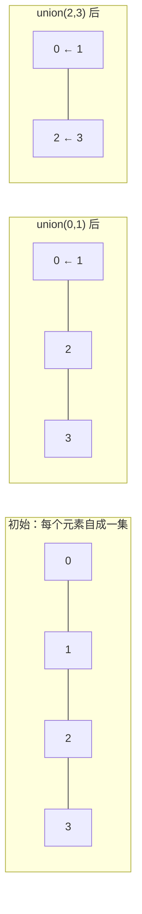

# 1.3.2 并查集、图与排序搜索 ⭐⭐⭐

> **机器人视觉定位**：**并查集（Union-Find）** 是点云欧式聚类和图像连通域分析的标准算法——面试手撕高频题、工程中天天用。**DFS/BFS** 遍历 SLAM 共视图、**排序**按置信度筛选检测框——这些算法构成了视觉后处理的基础设施。

---

## 1. 并查集 Union-Find ⭐⭐⭐

### 1.1 核心思想

并查集用于解决**连通性问题**：判断两个元素是否在同一个集合中，以及合并两个集合。



### 1.2 标准实现（必须能手写）

```python
class UnionFind:
    """
    并查集——带路径压缩和按秩合并
    时间复杂度：近乎 O(1)（反阿克曼函数）
    """
    def __init__(self, n: int):
        self.parent = list(range(n))  # 每个元素的父节点
        self.rank = [0] * n           # 树的高度（秩）
    
    def find(self, x: int) -> int:
        """
        查找 x 的根节点（路径压缩）
        递归过程中将路径上所有节点直接指向根
        """
        if self.parent[x] != x:
            self.parent[x] = self.find(self.parent[x])
        return self.parent[x]
    
    def union(self, x: int, y: int):
        """合并 x 和 y 所在的集合（按秩合并）"""
        px, py = self.find(x), self.find(y)
        if px == py:
            return
        
        # 将矮的树挂在高的树下
        if self.rank[px] < self.rank[py]:
            self.parent[px] = py
        elif self.rank[px] > self.rank[py]:
            self.parent[py] = px
        else:
            self.parent[py] = px
            self.rank[px] += 1  # 只有高度相同时，合并后高度 +1
    
    def connected(self, x: int, y: int) -> bool:
        """判断 x 和 y 是否连通"""
        return self.find(x) == self.find(y)
```

### 1.3 应用一：点云欧式聚类

```python
import numpy as np

def euclidean_clustering(points: np.ndarray, radius: float = 0.5):
    """
    基于欧氏距离的点云聚类
    
    Args:
        points: (N, 3) 点云数据
        radius: 聚类半径
    
    Returns:
        list of list: 每个聚类的点索引
    """
    n = len(points)
    uf = UnionFind(n)
    
    # 方法一：暴力 O(n²)——适合小规模点云
    for i in range(n):
        for j in range(i + 1, n):
            dist = np.linalg.norm(points[i] - points[j])
            if dist < radius:
                uf.union(i, j)
    
    # 收集聚类结果
    clusters = {}
    for i in range(n):
        root = uf.find(i)
        if root not in clusters:
            clusters[root] = []
        clusters[root].append(i)
    
    return list(clusters.values())

# 使用
points = np.random.randn(200, 3)  # 200 个点
clusters = euclidean_clustering(points, radius=0.5)
print(f"聚类数: {len(clusters)}")
for i, c in enumerate(clusters):
    print(f"  聚类 {i}: {len(c)} 个点")
```

### 1.4 应用二：图像连通域分析

```python
def connected_components(binary_img: np.ndarray):
    """
    用并查集标记二值图像的连通区域（四邻域）
    
    Args:
        binary_img: (H, W) 二值图像（0/1）
    
    Returns:
        labels: (H, W) 每个像素的连通域标签
        num_components: 连通域数量
    """
    h, w = binary_img.shape
    uf = UnionFind(h * w)
    
    def idx(r, c):
        return r * w + c
    
    # 第一遍：合并相邻的前景像素
    for r in range(h):
        for c in range(w):
            if binary_img[r, c] == 0:
                continue
            # 检查上方和左方邻域
            if r > 0 and binary_img[r-1, c]:
                uf.union(idx(r, c), idx(r-1, c))
            if c > 0 and binary_img[r, c-1]:
                uf.union(idx(r, c), idx(r, c-1))
    
    # 第二遍：重新标记
    labels = np.zeros((h, w), dtype=int)
    label_map = {}
    next_label = 1
    
    for r in range(h):
        for c in range(w):
            if binary_img[r, c]:
                root = uf.find(idx(r, c))
                if root not in label_map:
                    label_map[root] = next_label
                    next_label += 1
                labels[r, c] = label_map[root]
    
    return labels, next_label - 1
```

---

## 2. 图遍历：DFS 与 BFS ⭐⭐

### 2.1 DFS——SLAM 共视图遍历

```python
def dfs_covisibility(graph, start_node, visited=None):
    """
    DFS 遍历 SLAM 共视图
    graph: dict[node] = list[connected_nodes]
    """
    if visited is None:
        visited = set()
    
    visited.add(start_node)
    print(f"访问关键帧 {start_node}")
    
    for neighbor in graph[start_node]:
        if neighbor not in visited:
            dfs_covisibility(graph, neighbor, visited)
    
    return visited
```

### 2.2 BFS——图像连通域

```python
from collections import deque

def bfs_connected_components(image, start_x, start_y):
    """
    BFS 从 seed 点开始标记连通区域
    """
    h, w = image.shape
    q = deque()
    q.append((start_x, start_y))
    visited = set()
    visited.add((start_x, start_y))
    component = []
    
    while q:
        x, y = q.popleft()
        component.append((x, y))
        
        # 四邻域
        for dx, dy in [(1,0), (-1,0), (0,1), (0,-1)]:
            nx, ny = x + dx, y + dy
            if 0 <= nx < w and 0 <= ny < h:
                if image[ny, nx] == 255 and (nx, ny) not in visited:
                    visited.add((nx, ny))
                    q.append((nx, ny))
    
    return component
```

---

## 3. 排序与搜索 ⭐⭐

### 3.1 按置信度排序

```python
# Python 内置排序——Timsort，O(n log n)
detections = [
    {"label": "car", "score": 0.95},
    {"label": "person", "score": 0.87},
    {"label": "bicycle", "score": 0.92},
]

# 降序
detections.sort(key=lambda x: x["score"], reverse=True)

# 或使用 sorted（不修改原列表）
sorted_dets = sorted(detections, key=lambda x: x["score"], reverse=True)
```

### 3.2 Top-K 问题（堆实现）

```python
import heapq

def top_k_detections(detections, k=5):
    """
    从 N 个检测中取置信度最高的 K 个
    时间复杂度 O(N log K)——比全排序 O(N log N) 更快
    """
    if k <= 0:
        return []
    
    # 维护一个大小为 K 的最小堆
    heap = []
    for det in detections:
        if len(heap) < k:
            heapq.heappush(heap, (det["score"], det))
        elif det["score"] > heap[0][0]:
            heapq.heapreplace(heap, (det["score"], det))
    
    # 从堆中取出（降序排列）
    return [heapq.heappop(heap)[1] for _ in range(len(heap))][::-1]

# 使用
all_dets = [{"label": f"obj_{i}", "score": np.random.random()} 
            for i in range(1000)]
top5 = top_k_detections(all_dets, k=5)
for d in top5:
    print(f"{d['label']}: {d['score']:.3f}")
```

### 3.3 二分搜索——参数调优

```python
def find_optimal_nms_threshold(
    detections, 
    ground_truth,
    target_metric: float = 0.5
):
    """
    二分搜索找到使 mAP 最接近 target 的 NMS 阈值
    """
    lo, hi = 0.1, 0.9
    best_thresh = 0.5
    best_diff = float('inf')
    
    while hi - lo > 0.01:
        mid = (lo + hi) / 2
        metric = evaluate_nms(detections, ground_truth, mid)
        diff = abs(metric - target_metric)
        
        if diff < best_diff:
            best_diff = diff
            best_thresh = mid
        
        if metric > target_metric:
            lo = mid
        else:
            hi = mid
    
    return best_thresh
```

---

## 面试常考

> **Q1: 并查集的时间复杂度？**

```
近乎 O(1)。同时使用路径压缩 + 按秩合并时，
单次操作的时间复杂度为 O(α(n))，其中 α 是反阿克曼函数，
对于任何实际输入规模，α(n) ≤ 5。
```

> **Q2: DFS 和 BFS 分别用在什么地方？**

```
BFS：最短路径、连通域分析、层级遍历
DFS：拓扑排序（SLAM 共视图）、回溯、检测环
视觉中：连通域分析用 BFS（队列），共视图遍历用 DFS（栈/递归）
```

> **Q3: 为什么 Top-K 用堆比全排序快？**

```
全排序 O(N log N)，需要将所有数据排序
堆方法 O(N log K)，只需要维护 K 个元素
当 N=10000, K=5 时，堆方法快约 log(N)/log(K) ≈ 5 倍
```

---

## 必须掌握的要点

1. **并查集（Union-Find）**：**必须能手写**——点云聚类和连通域分析的核心
2. **路径压缩 + 按秩合并**：两个优化缺一不可
3. **Top-K 堆方法**：比全排序更高效的后处理写法
4. **DFS/BFS 模板**：图的两种遍历方式

---

[← 返回 1.3.0 总览与学习路径](1.3.0_总览与学习路径.md)
