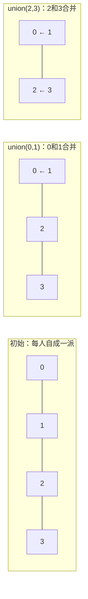

# 1.3.6 并查集 Union-Find ⭐⭐⭐

> **机器人视觉定位**：并查集是**点云欧式聚类**和**图像连通域分析**的核心算法。面试手撕高频题，工程中用于将空间上邻近的点快速归为同一类。1 秒钟处理完 10 万个点的聚类——全靠并查集的 O(α(n)) 效率。

---

## 1. 本质：快速回答两个问题

并查集不关心集合里具体有什么，它只回答两个问题：

1. **你俩是一伙的吗？** → `find(a) == find(b)`
2. **你俩合并成一伙。** → `union_sets(a, b)`

> **一句话本质**：并查集 = 一种专门管理"分组"的结构，核心就两个操作——**查（find）**：找组长；**并（union_sets）**：两组合并。时间复杂度 O(α(n))，比你想的任何一个常数时间操作都快。



---

## 2. 标准 C++ 实现 —— 逐行拆解

```cpp
#include <vector>
#include <numeric>  // for iota

class UnionFind {
private:
    // parent[i]：元素 i 的父节点，根节点的父节点指向自己
    // rank[i]：以 i 为根的树的"大致高度"（秩），用于按秩合并
    std::vector<int> parent;
    std::vector<int> rank;
    
public:
    // 构造函数：n 个元素，每个自成一派
    explicit UnionFind(int n) : parent(n), rank(n, 0) {
        // iota = 依次填充 0, 1, 2, ..., n-1
        // 初始时每个元素的父节点指向自己
        std::iota(parent.begin(), parent.end(), 0);
    }
    
    // ---- 核心操作 1：查找根节点（带路径压缩） ----
    int find(int x) {
        // 如果 x 的父节点不是自己，说明 x 不是根
        if (parent[x] != x) {
            // 递归找根，同时把 x 直接挂在根下（路径压缩）
            parent[x] = find(parent[x]);
        }
        return parent[x];
    }
    
    // ---- 核心操作 2：合并两个集合 ----
    void union_sets(int x, int y) {
        int root_x = find(x);  // 找 x 的根
        int root_y = find(y);  // 找 y 的根
        
        if (root_x == root_y) return;  // 已在同一集合
        
        // 按秩合并：矮树挂到高树下
        if (rank[root_x] < rank[root_y]) {
            parent[root_x] = root_y;   // x 的根指向 y 的根
        } else if (rank[root_x] > rank[root_y]) {
            parent[root_y] = root_x;   // y 的根指向 x 的根
        } else {
            parent[root_y] = root_x;   // 高度相同，随便挂
            rank[root_x]++;            // 合并后高度 +1
        }
    }
    
    // 判断 x 和 y 是否连通
    bool connected(int x, int y) {
        return find(x) == find(y);
    }
};
```

**代码拆解——为什么这样写？**

```
构造函数：
  - parent.size() = n，初始 parent[i] = i（每人自成一派）
  - rank[i] = 0（所有树的初始高度为 0）

find:
  - if (parent[x] != x)：只要不是根，就往上找
  - parent[x] = find(parent[x])：**路径压缩**——递归返回时直接把 x 挂在根下
  - 效果：第一次找稍慢，之后每次 O(1)

union_sets:
  - 先 find 找到两个根
  - 如果根相同，说明已经一伙了，不管
  - 按秩合并：rank 小的挂在 rank 大的下面，保持树平衡
  - 只有高度相同时，合并后高度才 +1
```

---

## 3. 视觉应用：点云欧式聚类（C++ 实现）

```cpp
#include <vector>
#include <cmath>
#include <unordered_map>

struct Point3D {
    float x, y, z;
};

// 计算两点欧氏距离平方（避免开方）
float distance_sq(const Point3D& a, const Point3D& b) {
    float dx = a.x - b.x;
    float dy = a.y - b.y;
    float dz = a.z - b.z;
    return dx * dx + dy * dy + dz * dz;
}

// 欧式聚类：距离 < radius 的点归为一类
// 返回聚类结果，每个聚类是一个点索引的 vector
std::vector<std::vector<int>> euclidean_clustering(
    const std::vector<Point3D>& points, float radius) {
    
    int n = points.size();
    UnionFind uf(n);
    float radius_sq = radius * radius;
    
    // 暴力 O(n²) —— 适合小规模点云（< 2000 点）
    // 大规模点云需用 KD-Tree 优化
    for (int i = 0; i < n; i++) {
        for (int j = i + 1; j < n; j++) {
            if (distance_sq(points[i], points[j]) < radius_sq) {
                uf.union_sets(i, j);
            }
        }
    }
    
    // 收集聚类结果：按根节点分组
    std::unordered_map<int, std::vector<int>> clusters_map;
    for (int i = 0; i < n; i++) {
        int root = uf.find(i);
        clusters_map[root].push_back(i);
    }
    
    // 转为 vector 返回
    std::vector<std::vector<int>> clusters;
    for (auto& [root, indices] : clusters_map) {
        clusters.push_back(std::move(indices));
    }
    return clusters;
}
```

---

## 4. 图像连通域分析（C++ 实现）

```cpp
#include <vector>
#include <unordered_map>

// 用并查集标记二值图像的连通区域（四邻域）
// 返回标记矩阵 labels，0=背景，>0 不同连通域
std::pair<std::vector<std::vector<int>>, int> connected_components(
    const std::vector<std::vector<int>>& binary_img) {
    
    int h = binary_img.size();
    int w = binary_img[0].size();
    int total = h * w;
    UnionFind uf(total);
    
    // 辅助函数：二维坐标 → 一维索引
    auto idx = [w](int r, int c) { return r * w + c; };
    
    // 第一遍扫描：合并相邻前景像素
    for (int r = 0; r < h; r++) {
        for (int c = 0; c < w; c++) {
            if (binary_img[r][c] == 0) continue;
            // 检查上方
            if (r > 0 && binary_img[r-1][c])
                uf.union_sets(idx(r, c), idx(r-1, c));
            // 检查左方
            if (c > 0 && binary_img[r][c-1])
                uf.union_sets(idx(r, c), idx(r, c-1));
        }
    }
    
    // 第二遍扫描：重新标记
    std::vector<std::vector<int>> labels(h, std::vector<int>(w, 0));
    std::unordered_map<int, int> label_map;
    int next_label = 1;
    
    for (int r = 0; r < h; r++) {
        for (int c = 0; c < w; c++) {
            if (binary_img[r][c]) {
                int root = uf.find(idx(r, c));
                if (label_map.find(root) == label_map.end())
                    label_map[root] = next_label++;
                labels[r][c] = label_map[root];
            }
        }
    }
    
    return {labels, next_label - 1};
}
```

---

## 面试常考

> **Q1: 并查集的时间复杂度为什么是 O(α(n))？**

```
同时使用路径压缩 + 按秩合并后，每次操作的时间复杂度
等于反阿克曼函数 α(n)。α(n) 增长极慢：
  n = 10⁰⁰⁰ 时 α(n) ≈ 5
所以可以认为：并查集的 find/union_sets 就是 O(1)。
```

> **Q2: 路径压缩和按秩合并，哪个更关键？**

```
路径压缩更重要。没有路径压缩，最坏情况树高 O(n)，
find 就是 O(n)。加了路径压缩后树高被"压平"。
按秩合并是锦上添花，保证树高不超过 O(log n)，
两者结合才达到 O(α(n))。
```

---

## 📝 测试题

**1. 本质理解** ⭐⭐
并查集的两个核心操作 find 和 union_sets 分别做了什么？为什么说路径压缩是"关键优化"？

**2. 代码实践** ⭐⭐⭐（C++ 实现）
用 C++ 实现 UnionFind 类，包含 `find`（路径压缩）、`union_sets`（按秩合并）、`connected` 三个方法。

**3. 代码实践** ⭐⭐⭐（C++ 实现）
给定 N 个点和连接关系，用并查集计算连通分量的数量。
```
输入: n = 6, connections = [(0,1), (1,2), (3,4)]
输出: 3  // 连通分量: {0,1,2}, {3,4}, {5}
```

**4. 视觉关联** ⭐⭐⭐
用 C++ 实现点云欧式聚类函数 `euclidean_clustering`，输入点云（`vector<Point3D>`）和聚类半径，输出每个聚类的点索引列表。

**5. 原理追问** ⭐⭐
如果不使用路径压缩，并查集的最坏情况时间复杂度是多少？什么场景下会出现这种最坏情况？