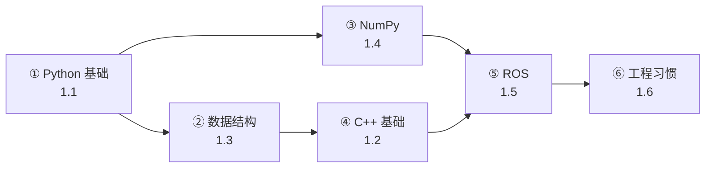

# 一、编程基础

> **与机器人视觉感知的关联**：编程是落地一切算法的载体。机器人视觉系统涉及**数据采集（传感器驱动）→ 预处理（图像/点云处理）→ 推理（深度学习模型）→ 后处理（检测解析/跟踪关联）→ 融合（多传感器）→ 控制输出（ROS 消息）** 全链路，每一环都需要扎实的编程能力。

---

## 内容目录

| 子专题 | 掌握程度 | 说明 |
|--------|:--------:|------|
| [1.1 Python — 核心语言](1.1_Python/1.1.0_总览与学习路径.md) | ⭐⭐⭐ | 数据处理、模型训练、推理脚本的主要语言 |
| [1.2 C++ 基础 — 部署与集成](1.2_C++基础/1.2.0_总览与学习路径.md) | ⭐⭐ | TensorRT/ROS 部署的核心语言 |
| [1.3 数据结构与算法](1.3_数据结构与算法/1.3.0_总览与学习路径.md) | ⭐⭐ | 跟踪管理、NMS、点云聚类的算法基础 |
| [1.4 NumPy 向量化编程](https://github.com/Han0301/stu_/blob/main/learn_sum/1.%E7%BC%96%E7%A8%8B%E5%9F%BA%E7%A1%80.md) | ⭐⭐⭐ | 高性能图像/点云处理的关键 |
| [1.5 ROS1/ROS2 — 机器人系统集成](https://github.com/Han0301/stu_/blob/main/learn_sum/1.%E7%BC%96%E7%A8%8B%E5%9F%BA%E7%A1%80.md) | ⭐⭐⭐ | 机器人系统集成必备 |
| [1.6 工程编码习惯](https://github.com/Han0301/stu_/blob/main/learn_sum/1.%E7%BC%96%E7%A8%8B%E5%9F%BA%E7%A1%80.md) | ⭐⭐ | 代码质量与工程规范 |

---

## 学习路径建议

> **学习顺序**：先 Python（1.1）打下基础，同时刷数据结构（1.3），掌握 NumPy（1.4）后进入 ROS（1.5），最后补齐 C++（1.2）和工程习惯（1.6）。
