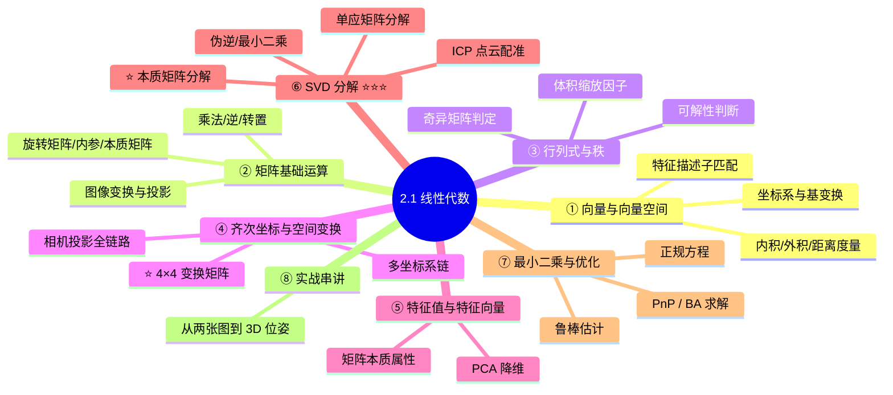
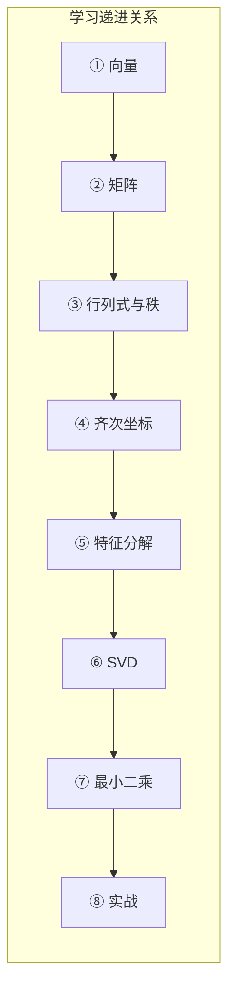

# 2.1 线性代数 ⭐⭐⭐

> **与机器人视觉感知的关联**：线性代数是机器人视觉的**底层语言**。图像是矩阵，空间变换是矩阵乘法，相机投影是**线性映射 + 齐次坐标**，特征匹配是**向量空间的距离度量**，全局优化求解是最小二乘问题。可以说——**你在机器人视觉中遇到的每一个算法，底层都是线性代数**。数学功底决定了你能在算法层面理解多深，而非仅仅调包。20K 岗位面试中，数学推导是区分"调参侠"和"真懂算法"的关键环节。

---

## 为什么线性代数对机器人视觉如此重要？

先看几个最直接的例子，让你感受线性代数在日常工作中出现的频率：

| 场景 | 涉及的线性代数概念 | 不理解的后果 |
|------|-------------------|-------------|
| 将检测框从像素坐标映射到世界坐标 | 齐次坐标、4×4 变换矩阵、矩阵求逆 | 无法将感知结果传递给下游规划模块 |
| 用 SORT/DeepSORT 做多目标跟踪 | 卡尔曼滤波（矩阵运算、协方差更新） | 只会调包，跟踪异常时完全不会排查 |
| 相机标定（张正友法） | 最小二乘、SVD、单应矩阵 | 标定结果误差大却不知道怎么优化 |
| YOLO 后处理 NMS | IoU 计算（向量运算、广播机制） | 后处理写得又慢又容易出 bug |
| 点云配准 (ICP) | SVD 分解求解最优旋转、最小二乘 | 不理解配准原理，参数调优全靠试 |
| 本质矩阵分解求位姿 | SVD 分解、矩阵零空间、特征值模式 | 不理解 PnP 和 SLAM 初始化原理 |
| 特征描述子匹配 | 向量内积/距离、高维空间 | 匹配效果差却不知道是距离度量还是阈值的问题 |
| 深度学习训练/推理 | 张量运算、批量矩阵乘法、广播 | 调试模型时不会分析中间 tensor 形状问题 |

---

## 学习路径

本专题按**递进关系**组织，建议按顺序学习：

---

---

[← 返回 线性代数目录](./)
