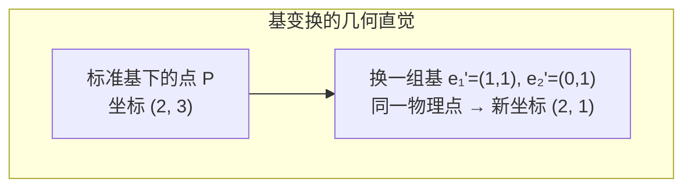
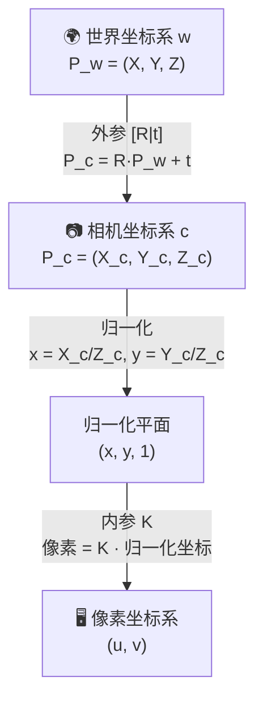
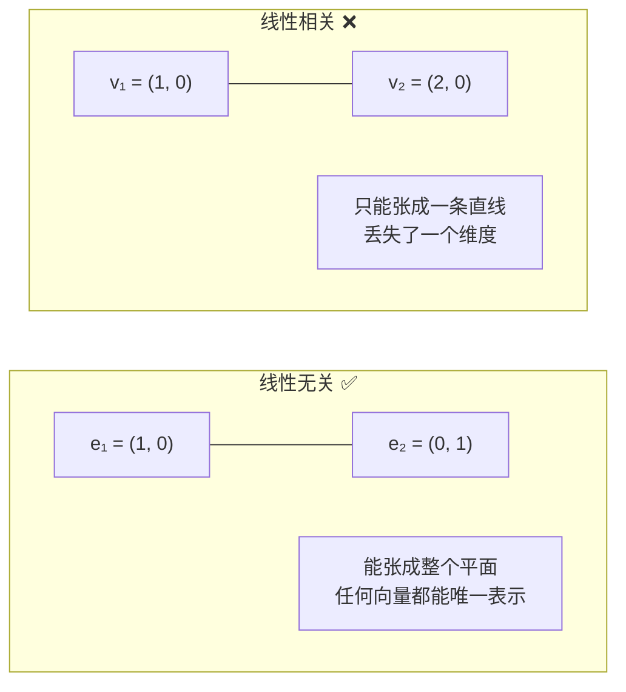
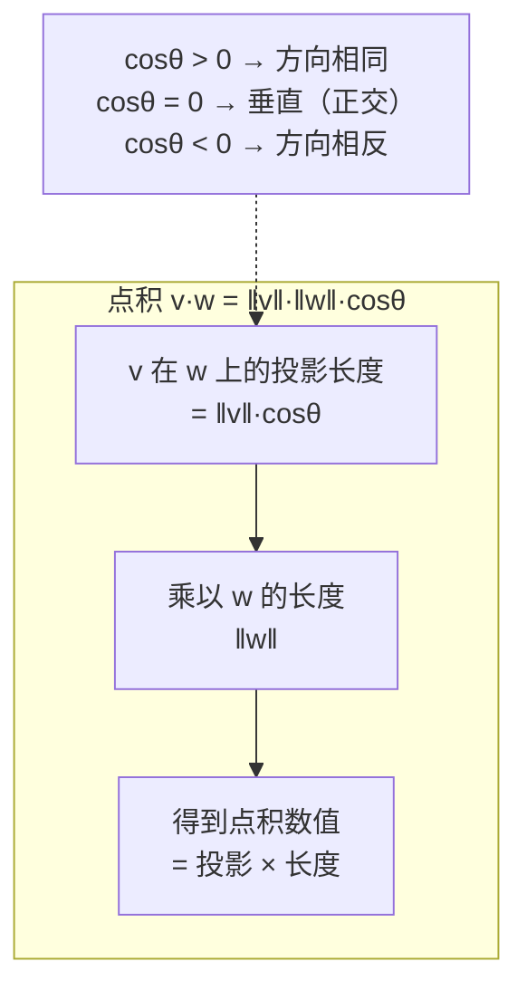

> **第一部分：向量与向量空间**

## 1.1 向量的基本概念

向量是有大小和方向的量。在机器人视觉中，向量几乎无处不在：

- **像素坐标**：`p = [u, v]^T`（2D 向量）
- **三维空间点**：`P = [X, Y, Z]^T`（3D 向量）
- **相机平移**：`t = [t_x, t_y, t_z]^T`（3D 向量）
- **特征描述子**：`d = [d_1, d_2, ..., d_128]^T`（128D 向量）

### 1.1.1 向量的基本运算

| 运算 | 定义 | 几何含义 | 视觉应用 |
|------|------|----------|----------|
| **加法** | `v + w = (v_1+w_1, ..., v_n+w_n)` | 平移的复合 | 相机位移叠加、像素偏移 |
| **数乘** | `αv = (αv_1, ..., αv_n)` | 缩放向量 | 坐标缩放、归一化 |
| **内积（点积）** | `v·w = Σ v_i·w_i` | 投影长度 × 原长度 | **特征匹配的核心！** |
| **外积（叉积）** | `v × w = [v]_× w`（仅 3D） | 垂直于 v,w 的向量、面积为 \|v×w\| | 计算法向量、本质矩阵中的反对称矩阵 |
| **范数（长度）** | `‖v‖ = √(v·v)` | 向量的长度 | 归一化特征、距离度量 |

### 1.1.2 必须掌握的向量运算代码

```python
import numpy as np

# 向量定义
p = np.array([1, 2, 3])       # 3D 点
q = np.array([4, 5, 6])

# 内积
dot = p @ q                    # Python 3.5+ 的 @ 运算符（推荐写法）
dot = np.dot(p, q)             # 等价
dot = np.sum(p * q)            # 逐元素乘法再求和（理解本质）

# 外积（叉积）
cross = np.cross(p, q)         # 返回垂直于 p,q 的向量

# 范数
norm_p = np.linalg.norm(p)     # L2 范数（欧几里得距离）
norm_p = np.sqrt(np.sum(p**2)) # 等效手写

# 单位向量（归一化）
unit_p = p / np.linalg.norm(p)

# 向量夹角
cos_theta = p @ q / (np.linalg.norm(p) * np.linalg.norm(q))
theta = np.arccos(np.clip(cos_theta, -1.0, 1.0))  # 防止数值误差超出 [-1,1]
```

### 1.1.3 外积与反对称矩阵（面试高频）

**什么是反对称矩阵？**

满足 `A^T = -A` 的方阵。3×3 形式为：

```
[a]_× = [[  0, -a3,  a2],
         [ a3,   0, -a1],
         [-a2,  a1,   0]]
```

| 性质 | 公式 | 含义 |
|------|------|------|
| **定义** | A^T = -A | 转置等于负的原矩阵 |
| **对角元** | a_ii = 0 | 主对角线全为零 |
| **自由度** | 3×3 由 3 个参数决定 | 与向量 a 一一对应 |
| **核心作用** | [a]_× · b = a × b | 把叉积变成矩阵乘法 |

```python
# 外积的矩阵形式：a × b = [a]_× b
# [a]_× 是反对称矩阵
def skew_symmetric(a):
    """构造向量 a 的反对称矩阵 [a]_×"""
    return np.array([
        [0,    -a[2],  a[1]],
        [a[2],  0,    -a[0]],
        [-a[1], a[0],  0   ]
    ])

# 验证：反对称矩阵定义的三个体现
a = np.array([1, 2, 3])
A = skew_symmetric(a)
print("A^T = -A ?", np.allclose(A.T, -A))   # ✅ 定义
print("对角元全零:", np.diag(A))             # ✅ [0, 0, 0]

# 验证：反对称矩阵 × 向量 = 叉积
b = np.array([4, 5, 6])
result1 = np.cross(a, b)
result2 = skew_symmetric(a) @ b
assert np.allclose(result1, result2)  # 结果相同
```

> **为什么重要？** 本质矩阵 `E = t^× R`（本质矩阵，描述两视图间的对极约束；`t` 是相机间平移，`R` 是相机间旋转）中的 `t^×` 就是反对称矩阵。这个形式出现在**多视图几何的所有核心公式**中。

**一句话总结**：反对称矩阵 = 把向量 a 编码成矩阵，使得 `[a]_×·b = a×b`，让叉积能参与矩阵运算和求导。这正是本质矩阵、so(3) 李代数等概念的基础。

---

## 1.2 向量空间与基

### 1.2.1 向量空间的定义

向量空间是一组向量的集合，满足对加法和数乘封闭。在视觉中最重要的向量空间是 **ℝⁿ**（n 维欧氏空间）。

**为什么这很重要？**
- 相机的**世界坐标系**是一个向量空间，原点在某个约定位置
- 相机的**相机坐标系**是另一个向量空间，原点在相机光心
- 同一个 3D 点在这两个空间中用**不同的坐标向量**表示——这就需要**基变换**

### 1.2.2 基与坐标变换

一组基是张成整个向量空间的线性无关向量集合。向量在不同基下的坐标通过**基变换矩阵**转换。



> **关键理解**：同一个物理点，在不同基（坐标系）下有不同的坐标值。机器人视觉中，"基变换"就是**坐标系转换**。

在机器人视觉中，坐标变换的典型链路如下：



一个 3D 点 `P_w` 在世界坐标系中，到相机坐标系中的转换是：

```python
def transform_world_to_camera(P_w, R_wc, t_wc):
    """世界坐标系 → 相机坐标系
    P_w: (3,) 世界系下的点坐标
    R_wc: (3,3) 旋转矩阵（世界系→相机系）
    t_wc: (3,) 平移向量
    """
    return R_wc @ P_w + t_wc

def transform_camera_to_world(P_c, R_wc, t_wc):
    """相机坐标系 → 世界坐标系（反向变换）"""
    return R_wc.T @ (P_c - t_wc)  # R^T = R^(-1)
```

### 1.2.3 线性相关/无关的视觉意义



**在机器人视觉中**，线性相关/无关直接对应空间维度的"丢失"：

- **本质矩阵 E 的秩为 2**：因为 `t^×` 的秩为 2（平移的反对称矩阵有一个零空间），所以 E 也秩为 2。这意味着 E 有一个一维零空间，对应平移方向 t。
- **单应矩阵 H 的秩为 3**：当相机只旋转不平移时，可以用 3×3 单应矩阵描述两帧间的关系。

```python
# 从本质矩阵 E 恢复平移 t
# E 的零空间向量就是 t（仅方向）
_, _, Vt = np.linalg.svd(E)
t = Vt[-1, :]  # 最小奇异值对应的右奇异向量 = t 的方向
```

---

## 1.3 内积与距离度量

### 1.3.1 向量内积的几何直觉



> **一句话直觉**：点积 = "一个向量在另一个方向上的分量" × "另一个向量的长度"。当两个向量方向一致时点积最大，垂直时为零——这正是**特征匹配**的核心思想：方向越相似的描述子，点积越大。

### 1.3.2 常见距离度量

在特征匹配中，我们需要度量两个描述子向量的"相似程度"。

| 距离 | 公式 | 特点 | 视觉应用 |
|------|------|------|----------|
| **欧氏距离（L2）** | `d = ‖v - w‖₂` | 最常用，对噪声敏感 | SIFT/SURF 描述子匹配 |
| **曼哈顿距离（L1）** | `d = Σ\|v_i - w_i\|` | 对 outlier 更鲁棒 | BRIEF/ORB 二值描述子匹配 |
| **余弦相似度** | `cosθ = (v·w)/(‖v‖‖w‖)` | 只关心方向，忽略长度 | 深度学习特征（人脸识别、ReID） |
| **汉明距离** | 不同二进制位的数量 | 计算极快 | ORB 描述子 |

```python
def euclidean_distance(v, w):
    return np.linalg.norm(v - w)

def cosine_similarity(v, w):
    return v @ w / (np.linalg.norm(v) * np.linalg.norm(w))

# ⭐ 批量距离矩阵计算（面试高频）
def pairwise_distance(desc1, desc2):
    """desc1: (N, D), desc2: (M, D) → (N, M) 距离矩阵
    利用公式：‖a-b‖² = ‖a‖² + ‖b‖² - 2a·b
    """
    dot = desc1 @ desc2.T                       # (N, M)
    norm1 = np.sum(desc1**2, axis=1, keepdims=True)   # (N, 1)
    norm2 = np.sum(desc2**2, axis=1, keepdims=True)   # (M, 1)
    dists = norm1 + norm2.T - 2 * dot
    return np.sqrt(np.clip(dists, a_min=0, a_max=None))
```

### 1.3.3 特征匹配中的实际应用

```python
def match_features(desc_query, desc_db, ratio_thresh=0.8):
    """
    desc_query: (N, D) 查询图像的描述子
    desc_db: (M, D) 数据库图像的描述子
    return: 匹配对列表 [(idx_query, idx_db, distance)]
    """
    dists = pairwise_distance(desc_query, desc_db)  # (N, M)
    
    # 对每个查询，找最近邻和次近邻
    sorted_indices = np.argsort(dists, axis=1)
    dist_nn = np.take_along_axis(dists, sorted_indices[:, :1], axis=1).squeeze()
    dist_2nn = np.take_along_axis(dists, sorted_indices[:, 1:2], axis=1).squeeze()
    
    # Lowe's ratio test — 最佳/次佳 < 阈值才接受
    ratios = dist_nn / (dist_2nn + 1e-10)
    good = ratios < ratio_thresh
    
    matches = [(i, sorted_indices[i, 0], dist_nn[i]) 
               for i in np.where(good)[0]]
    return matches
```

---

---

[← 返回 2.1.0 总览与学习路径](2.1.0_总览与学习路径.md)

---

## 📝 测试题

**1. 本质理解** ⭐
向量内积 `v·w` 的几何含义是什么？当内积为零、为正、为负时分别说明两个向量的方向关系。

**2. 概念辨析** ⭐⭐
外积 `a × b` 和反对称矩阵 `[a]_×` 是什么关系？为什么在机器人视觉中"把叉积写成矩阵形式"如此重要？

**3. 代码实践** ⭐⭐
写一个函数 `pairwise_distance(desc1, desc2)`，输入两个描述子矩阵 (N,D) 和 (M,D)，输出 (N,M) 的欧氏距离矩阵。要求利用公式 `‖a-b‖² = ‖a‖² + ‖b‖² - 2a·b` 实现，禁止使用 for 循环。

**4. 视觉关联** ⭐⭐⭐
在 SLAM 特征匹配中，Lowe's ratio test（最近邻/次近邻 < 阈值）的目的是什么？为什么用余弦相似度而不用欧氏距离来衡量深度学习特征的匹配程度？

**5. 原理追问** ⭐⭐
"向量空间"和"坐标系"在本质上是什么关系？为什么同一个物理点在不同坐标系下有不同坐标？

**参考答案要点**
1. v 在 w 方向投影 × w 的长度；零→垂直，正→同向，负→反向
2. [a]_×·b = a×b，矩阵形式可参与求导和优化
3. 利用广播：dists = norm1 + norm2.T - 2*dot，再开方
4. 排除歧义匹配；深度特征更关注方向而非模长，余弦相似度正好只度量方向
5. 坐标系就是基的具体选择，基变换 = 坐标变换
