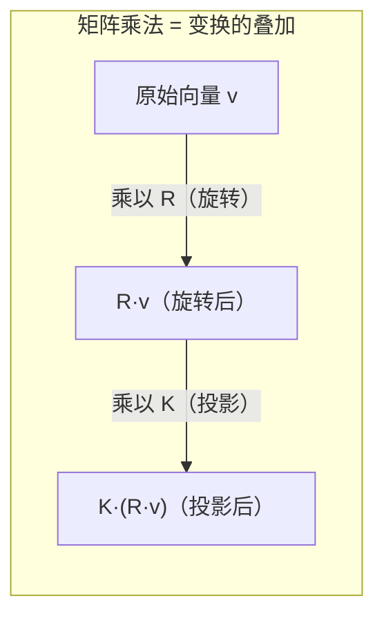

> **第二部分：矩阵基础运算**

## 2.1 矩阵的定义与操作

### 2.1.1 机器人视觉中的常见矩阵

| 矩阵 | 尺寸 | 含义 | 性质 |
|------|------|------|------|
| 旋转矩阵 R | 3×3 | 描述刚体旋转 | R^T R = E, det(R) = 1（正交矩阵）→ R⁻¹ = R^T |
| 相机内参 K | 3×3 | 焦距、光心、畸变 | 上三角矩阵 |
| 本质矩阵 E | 3×3 | 两视图间的对极约束 | 秩为 2，奇异值模式 (σ, σ, 0) |
| 基础矩阵 F | 3×3 | 两视图间的对极约束（含内参） | 秩为 2 |
| 单应矩阵 H | 3×3 | 平面变换（旋转+纯平移或平面场景） | 可逆 |
| 变换矩阵 T | 4×4 | 刚体变换的齐次形式 | 可逆 |

### 2.1.2 矩阵乘法的几何含义

矩阵乘法的本质是**线性变换的复合**。理解这一点，就能理解为什么视觉中处处是矩阵乘法：



> **关键直觉**：矩阵乘法是从右向左读的变换流水线。`y = K @ (R @ v)` 先旋转、再投影——**顺序不可交换**，因为矩阵乘法不满足交换律（`AB ≠ BA`）。

### 2.1.3 维度匹配——矩阵乘法的命门

```python
# 矩阵乘法维度规则：(M, K) @ (K, N) → (M, N)
# 内维必须相等

# 视觉中的典型矩阵乘法链
# 相机投影：像素 = K @ [R|t] @ 世界点
K = np.array([[500,   0, 320],    # 内参矩阵 (3, 3)
              [  0, 500, 240],
              [  0,   0,   1]])
R = np.eye(3)                       # 旋转矩阵 (3, 3)
t = np.array([0.1, -0.2, 1.0])     # 平移向量 (3,)

# 世界点 → 像素
P_w = np.array([2.0, 3.0, 5.0])    # (3,)
P_c = R @ P_w + t                   # (3,) 相机坐标系
p_pixel = K @ (P_c / P_c[2])        # (3,) 像素齐次坐标
print(f"像素坐标: ({p_pixel[0]:.1f}, {p_pixel[1]:.1f})")
```

### 2.1.3 矩阵的逆

**什么时候需要求逆？** 几乎无处不在：

```python
# 1. 从像素坐标反推归一化坐标（去内参）
p_pixel = np.array([400, 300, 1])
K_inv = np.linalg.inv(K)           # 内参逆矩阵
p_norm = K_inv @ p_pixel           # 归一化坐标 [x, y, 1]

# 2. 坐标系反向变换
T_wc = np.eye(4)
T_wc[:3, :3] = R                   # 世界→相机的变换矩阵
T_wc[:3, 3] = t
T_cw = np.linalg.inv(T_wc)         # 相机→世界的逆变换（直接求逆）
# 对刚体变换，也可以用转置技巧
T_cw_fast = np.eye(4)
T_cw_fast[:3, :3] = R.T
T_cw_fast[:3, 3] = -R.T @ t
```

> **关键理解**：对于旋转矩阵 R，逆 = 转置（`R^(-1) = R^T`），这是正交矩阵的性质。但对一般矩阵，逆必须用 `np.linalg.inv` 或求解线性方程组。

### 2.1.4 矩阵的转置与对称性

- **转置 `A^T`**：交换行列，`(AB)^T = B^T A^T`
- **对称矩阵 `A = A^T`**：协方差矩阵、内参矩阵中的某些部分
- **反对称矩阵 `A = -A^T`**：`[t]_×` 的形式

```python
# 协方差矩阵一定是对称半正定的
cov = np.array([[0.1, 0.02, 0.01],
                [0.02, 0.08, 0.015],
                [0.01, 0.015, 0.12]])
assert np.allclose(cov, cov.T)  # 对称性验证
```

---

---

[← 返回 2.1.0 总览与学习路径](2.1.0_总览与学习路径.md)
