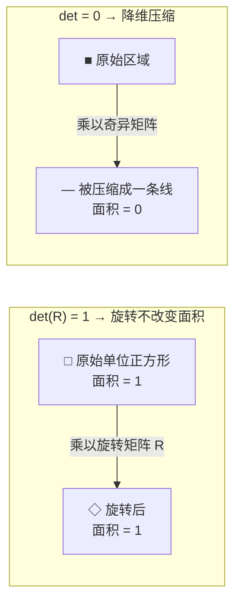
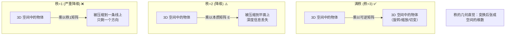

> **第三部分：行列式与秩**

## 3.1 行列式

### 3.1.1 几何含义

行列式的绝对值等于矩阵对应线性变换的**体积缩放因子**。



| 情况 | 行列式值 | 几何意义 | 视觉中的体现 |
|------|---------|----------|-------------|
| **旋转矩阵 R** | det(R) = 1 | 纯旋转，体积不变 | 相机旋转不影响物体的"大小" |
| **缩放矩阵 sI** | det = sⁿ | 均匀缩放 | 图像缩放变换 |
| **奇异矩阵** | det = 0 | 空间被压缩了一个维度 | 本质矩阵 E（3D→2D 压缩） |
| **矩阵不可逆** | det ≈ 0（病态） | 接近奇异 | 相机标定时标定板姿态太接近，求解不稳定 |

### 3.1.2 视觉中的体现

```python
# 1. 判断本质矩阵 E 是否奇异
assert np.abs(np.linalg.det(E)) < 1e-6  # E 是奇异的（秩为 2）

# 2. 判断旋转矩阵合法性
R_candidate = ...  # 某个 3×3 矩阵
if np.abs(np.linalg.det(R_candidate) - 1.0) < 1e-6:
    print("这是一个合法的旋转矩阵")
```

## 3.2 矩阵的秩

### 3.2.1 秩的物理意义

**秩 = 线性无关的行（或列）的最大数目 = 变换后空间的维数**



| 矩阵 | 秩 | 物理含义 |
|------|----|----------|
| 旋转矩阵 R | 3 | 3D 空间中的旋转，满秩 |
| 本质矩阵 E | 2 | 将空间压缩到 2 维（对极约束平面） |
| 单应矩阵 H | 3 | 平面到平面的映射，满秩 |
| 相机投影矩阵 P | 3 | 3D→2D 投影（损失一维深度信息） |

```python
# 计算矩阵的秩
rank_E = np.linalg.matrix_rank(E)     # 应该为 2
rank_H = np.linalg.matrix_rank(H)     # 应该为 3
```

---

---

[← 返回 2.1.0 总览与学习路径](2.1.0_总览与学习路径.md)
