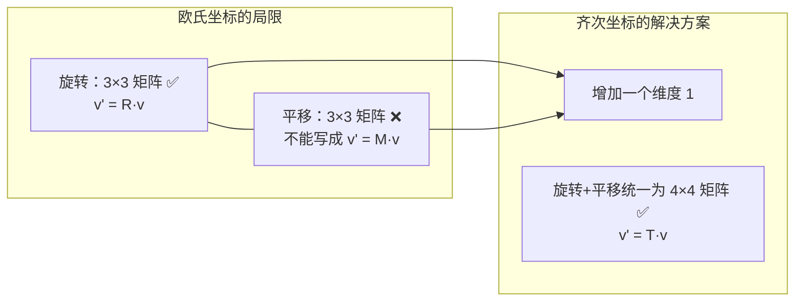
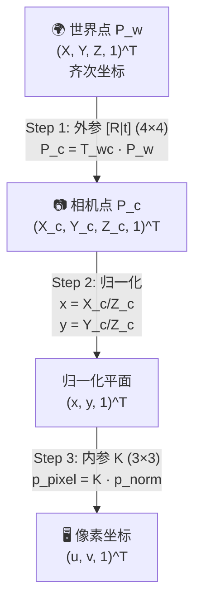
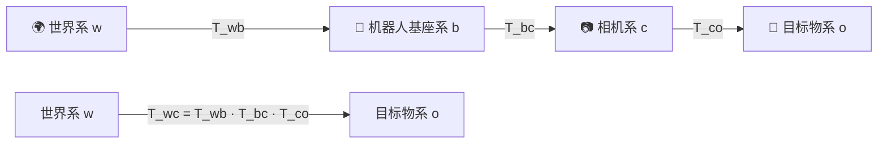

> **第四部分：齐次坐标与空间变换** ⭐⭐⭐

## 4.1 为什么要用齐次坐标？

### 4.1.0 核心动机：用线性变换统一处理"旋转+平移"



**一句话解释**：在欧氏坐标中，平移是"加一个向量"，不是线性变换（无法用矩阵乘法表示）。齐次坐标把"加"伪装成"乘"——通过多一个维度，让平移也变成矩阵乘法。


在标准欧氏坐标中，**平移不是线性变换**——你不能用 3×3 矩阵表示"旋转+平移"。齐次坐标通过增加一个维度，将仿射变换统一为线性变换。

### 4.1.1 从欧氏到齐次

```python
# 欧氏坐标 → 齐次坐标（加 1）
P_euclidean = np.array([1.0, 2.0, 3.0])
P_homogeneous = np.array([1.0, 2.0, 3.0, 1.0])

# 齐次坐标 → 欧氏坐标（前三维除以第四维）
P_back = P_homogeneous[:3] / P_homogeneous[3]

# 关键：齐次坐标的缩放不变性
# [2, 4, 6, 2]^T 和 [1, 2, 3, 1]^T 表示同一个 3D 点
```

### 4.1.2 4×4 变换矩阵（必须闭着眼能写）

```python
# 刚体变换的齐次形式
T = np.eye(4)
T[:3, :3] = R          # 旋转部分
T[:3, 3]  = t          # 平移部分
print(T)
# [[R R R | tx]
#  [R R R | ty]
#  [R R R | tz]
#  [0 0 0 | 1 ]]

# 链式变换：多个坐标系的累积
T_wc = T_wb @ T_bc     # 世界→基座→相机
# 读法：从右往左。先把点从相机系(c)变换到基座系(b)，再变换到世界系(w)
# 下标抵消：T_wc = (w←b) · (b←c)，中间的 b 抵消，剩下 w←c
# 
# 具体拆解：
#   P_w = T_wc @ P_c
#       = T_wb @ (T_bc @ P_c)    ← 先到基座系
#       = T_wb @ P_b             ← 再到世界系
#       = P_w                     ← 最终到世界系
```

### 4.1.3 相机投影全链路（面试必须能手写）



> **一句话记忆**：3D 世界 →（外参）→ 相机系 →（除以 Z）→ 归一化平面 →（内参）→ 像素。**这个三步骤必须闭着眼也能画出来。**

```python
def project_world_to_pixel(P_w, K, R_wc, t_wc):
    """世界 3D 点 → 像素坐标 完整链路"""
    # Step 1: 世界系 → 相机系 (外参)
    P_c = R_wc @ P_w + t_wc                    # (3,)
    
    # Step 2: 相机系 → 归一化平面（除以深度 Z）
    x, y, z = P_c
    p_norm = np.array([x/z, y/z, 1.0])         # (3,)
    
    # Step 3: 归一化平面 → 像素 (内参)
    p_pixel = K @ p_norm                       # (3,)
    u, v = p_pixel[0], p_pixel[1]
    
    return np.array([u, v])


# 完整投影公式（一行版）— 面试手撕版
def project(P_w, K, R, t):
    """z * [u, v, 1]^T = K * [R|t] * [X, Y, Z, 1]^T"""
    P_c = R @ P_w + t
    p = K @ (P_c / P_c[2])
    return p[:2]
```

### 4.1.4 多坐标系链式变换

机器人视觉中很少只有一个坐标系，往往是**多个坐标系串联**：



> **关键**：链式变换用矩阵乘法串联，`T_wc = T_wb @ T_bc @ T_co`。顺序**从右往左**读——"先把点从目标物坐标系变换到相机系，再变换到基座系，最后变换到世界系"。
>
> 下标抵消法：`T_wc` 中间的 `b` 和 `c` 逐层抵消，`T_wc = (w←b) · (b←c) · (c←o)`，只剩下 `w←o`。
>
> **示例**：相机装在机器人上，机器人站在世界系中
> ```python
> # 相机在基座上的安装位置（偏移 0.5m 向前，0.2m 向上）
> T_bc = np.eye(4)
> T_bc[:3, 3] = [0.5, 0, 0.2]
> 
> # 机器人在世界系中的位姿（位置 (2,3,0)，绕 Z 转 45°）
> T_wb = np.array([[0.866, -0.5, 0, 2],
>                  [0.5,   0.866, 0, 3],
>                  [0,     0,     1, 0],
>                  [0,     0,     0, 1]])
> 
> # 世界系下相机的位置 = 综合了机器人位置和安装偏移
> T_wc = T_wb @ T_bc
> print(f"相机在世界系位置: {T_wc[:3, 3]}")
> ```
> 这就是 SLAM 中**坐标系变换链**的核心思想——每多一个坐标系，就在链上多乘一个矩阵。

---

---

[← 返回 2.1.0 总览与学习路径](2.1.0_总览与学习路径.md)

---

## 📝 测试题

**1. 本质理解** ⭐⭐⭐
为什么不能用 3×3 矩阵表示"旋转+平移"？齐次坐标如何解决这个问题？

**2. 概念辨析** ⭐⭐
链式变换 `T_wc = T_wb @ T_bc` 的几何含义是什么？请用"下标抵消法"解释。

**3. 视觉关联** ⭐⭐⭐
手写相机投影函数 `project(P_w, K, R, t)`，输入世界坐标系下的 3D 点 (X,Y,Z)，输出像素坐标 (u,v)。要求写出完整的三步流程。

**4. 原理追问** ⭐⭐
齐次坐标的缩放不变性是什么意思？为什么 `(x, y, z, 1)^T` 和 `(2x, 2y, 2z, 2)^T` 表示同一个 3D 点？

**5. 代码实践** ⭐⭐
已知相机内参 K 和在世界系中的位姿 T_wc，写代码将相机系下的一个点 P_c 反投影到世界系坐标。
