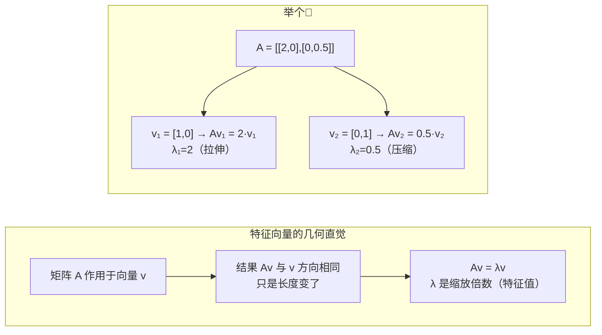
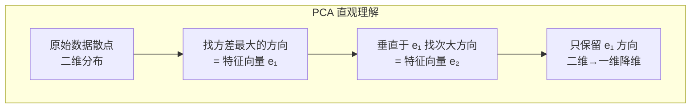

> **第五部分：特征值与特征向量**

## 5.1 定义与几何含义

对于方阵 A，若存在非零向量 v 和标量 λ 满足 `Av = λv`，则 λ 是特征值，v 是对应的特征向量。



**几何含义**：特征向量是矩阵 A 的**不改变方向**的特殊方向，特征值是在该方向上的缩放倍数。

> **核心直觉**：想象一个矩阵是一个"变形器"，它拉伸、压缩、旋转空间中的每个方向。特征向量就是那些"只被拉伸/压缩、不被旋转"的特殊方向——这些方向揭示了矩阵最本质的变换特性。

## 5.2 在机器人视觉中的应用

### 5.2.1 PCA 降维（特征分解）



PCA 的本质：对协方差矩阵做特征分解，取最大的 k 个特征值对应的特征向量作为主方向。

```python
def pca(X, n_components=2):
    """
    X: (N, D) 数据矩阵，每行一个样本
    返回：主方向、降维后的数据、解释方差比
    """
    # 去中心化
    X_mean = np.mean(X, axis=0)
    X_centered = X - X_mean
    
    # 协方差矩阵
    cov = (X_centered.T @ X_centered) / (X.shape[0] - 1)
    
    # 特征分解
    eigenvalues, eigenvectors = np.linalg.eigh(cov)
    
    # 按特征值从大到小排序
    idx = np.argsort(eigenvalues)[::-1]
    eigenvalues = eigenvalues[idx]
    eigenvectors = eigenvectors[:, idx]
    
    # 取前 n_components 个主方向
    W = eigenvectors[:, :n_components]
    X_pca = X_centered @ W  # 降维
    
    # 解释方差比
    explained_ratio = eigenvalues[:n_components] / eigenvalues.sum()
    
    return W, X_pca, explained_ratio
```

### 5.2.2 本质矩阵的特征值结构

本质矩阵 `E = t^× R`（本质矩阵，对极约束的代数表达；`t` 是平移，`R` 是旋转）的特征值结构是**面试必考**知识点：

```python
# 本质矩阵 E 的奇异值模式
_, S, _ = np.linalg.svd(E)
print(f"奇异值: {S}")  # 应该是 [σ, σ, 0] 的形式
# 两个相等的大奇异值 + 一个零奇异值
```

这告诉你：E 的秩为 2，且两个非零奇异值相等——这是本质矩阵区别于任意 3×3 矩阵的关键性质。

---

---

[← 返回 2.1.0 总览与学习路径](2.1.0_总览与学习路径.md)
