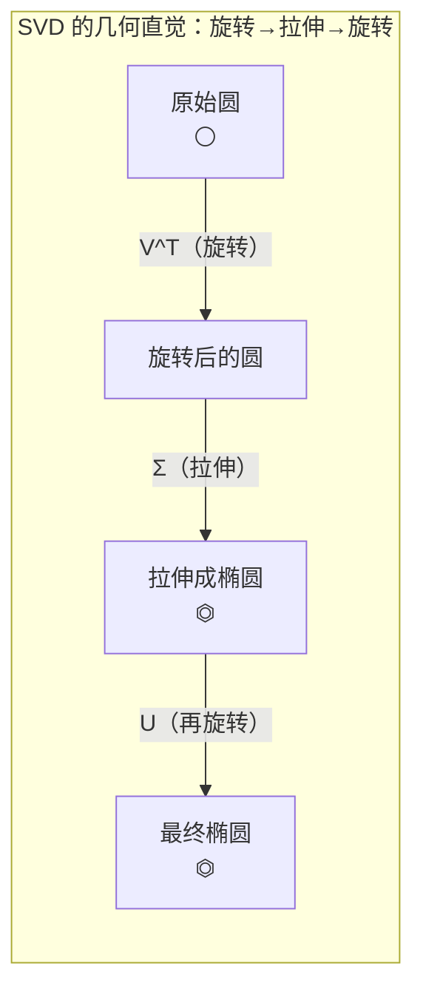
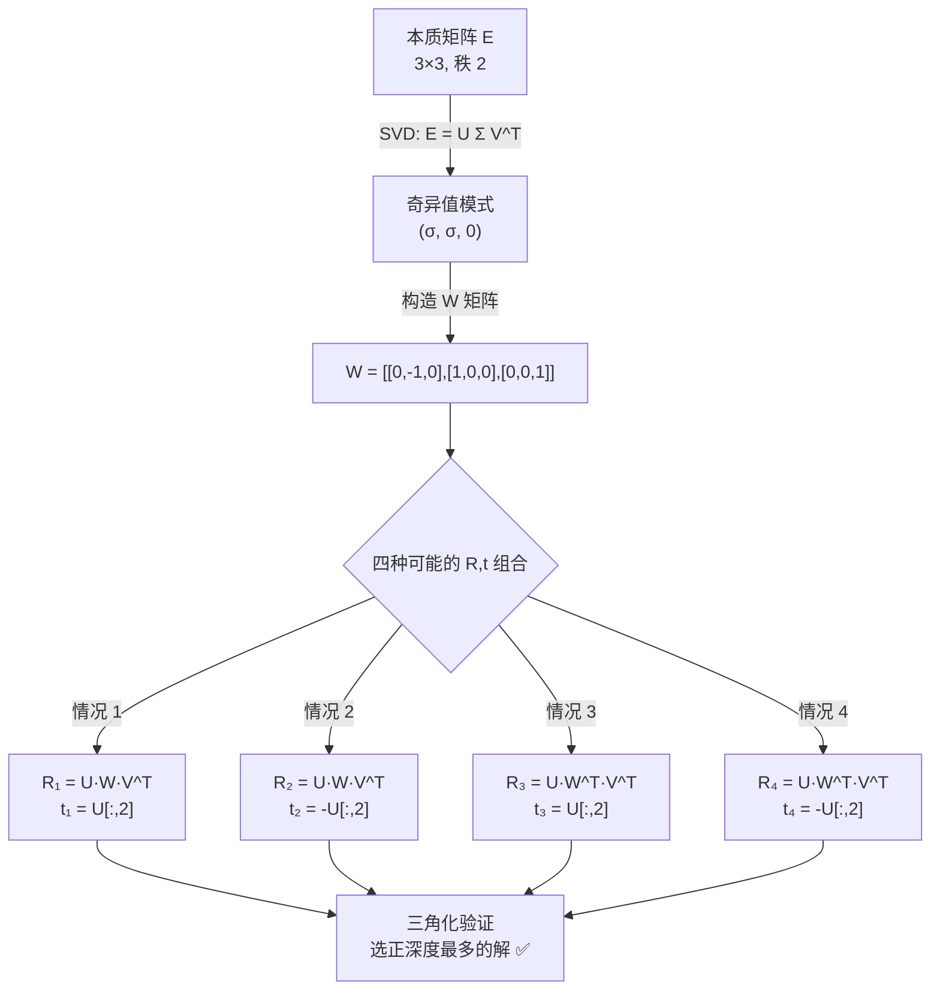
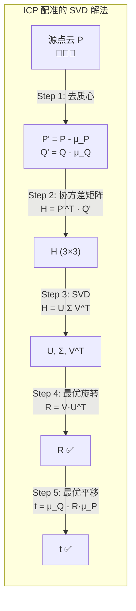

> **第六部分：SVD 分解** ⭐⭐⭐

## 6.1 SVD 的定义

任意矩阵 `A ∈ ℝ^(m×n)` 都可以分解为：

    A = U Σ V^T

（`U` 是 m×m 左奇异向量正交矩阵，`Σ` 是 m×n 奇异值对角矩阵，`V` 是 n×n 右奇异向量正交矩阵）



> **一句话直觉**：任何矩阵变换都可以拆解为三步——先旋转（V^T），再沿着坐标轴拉伸（Σ），最后再旋转一次（U）。这个"旋转-拉伸-旋转"的分解，就是 SVD 的几何本质。

其中：
- `U ∈ ℝ^(m×m)`：左奇异向量（正交矩阵，列是 AA^T 的特征向量）
- `Σ ∈ ℝ^(m×n)`：奇异值对角矩阵（从大到小排列）。**奇异值的大小决定每个方向的重要程度**
- `V ∈ ℝ^(n×n)`：右奇异向量（正交矩阵，列是 A^T A 的特征向量）

```python
# NumPy 中的 SVD
A = np.random.randn(3, 3)
U, S, Vt = np.linalg.svd(A)
# U: (3,3), S: (3,), Vt: (3,3)
# A = U @ diag(S) @ Vt

# 验证分解是否正确
A_recovered = U @ np.diag(S) @ Vt
assert np.allclose(A, A_recovered)
```

## 6.2 SVD 在机器人视觉中的四大核心应用

### 6.2.1 应用一：最小二乘求解（伪逆）

求解线性方程组 `Ax = b`，当 A 不可逆或 m ≠ n 时：

```python
def solve_via_svd(A, b):
    """用 SVD 求解最小二乘：Ax ≈ b"""
    U, S, Vt = np.linalg.svd(A, full_matrices=False)
    
    # 伪逆：A⁺ = V Σ⁺ U^T
    # 奇异值取倒数
    S_inv = np.diag(1.0 / S)
    A_pinv = Vt.T @ S_inv @ U.T
    x = A_pinv @ b
    return x

# 等价于
x = np.linalg.lstsq(A, b, rcond=None)[0]
x = np.linalg.pinv(A) @ b
```

### 6.2.2 应用二：本质矩阵分解求位姿（面试必考）

**为什么本质矩阵能恢复位姿？**

对极几何告诉我们：两帧间的匹配点满足 `x_2^T E x_1 = 0`。E 包含了相机的相对旋转 R 和平移 t（`E = t^× R`）。SVD 可以将 E "拆开"成 R 和 t。



> **为什么有 4 种解？** 因为从 E 恢复位姿存在**符号歧义**（t 的正负）和**共轭旋转歧义**（W vs W^T）。真实的解必须让所有 3D 点在相机前方（正深度）——通过三角化验证即可选出唯一正确解。

从本质矩阵 E 恢复旋转 R 和平移 t：

```python
def recover_pose_from_E(E):
    """
    从本质矩阵 E 恢复 R, t
    E = U diag(σ, σ, 0) V^T
    
    W = [[0, -1, 0],
         [1,  0, 0],
         [0,  0, 1]]
    
    四种解：
    1. R = U W V^T,   t = U[:, 2]
    2. R = U W V^T,   t = -U[:, 2]
    3. R = U W^T V^T, t = U[:, 2]
    4. R = U W^T V^T, t = -U[:, 2]
    
    通过三角化点的正深度选唯一解
    """
    U, _, Vt = np.linalg.svd(E)
    
    # 确保 det = +1（旋转矩阵的行列式必须为 1）
    if np.linalg.det(U) < 0:
        U[:, -1] *= -1
    if np.linalg.det(Vt) < 0:
        Vt[-1, :] *= -1
    
    W = np.array([[0, -1, 0],
                  [1,  0, 0],
                  [0,  0, 1]])
    
    # 四种可能解
    R1 = U @ W @ Vt
    R2 = U @ W @ Vt
    R3 = U @ W.T @ Vt
    R4 = U @ W.T @ Vt
    t1 = t3 = U[:, 2]
    t2 = t4 = -U[:, 2]
    
    # 实际中需要三角化验证，选正深度最多的那个解
    candidates = [(R1, t1), (R2, t2), (R3, t3), (R4, t4)]
    return candidates
```

### 6.2.3 应用三：点云配准（ICP 中的 SVD 解法）



> **为什么 SVD 能解 ICP？** 去质心后，问题变成 `min Σ‖R·p_i' - q_i'‖²`。展开后等价于 `max tr(R^T H)`，其中 `H = Σ p_i'·q_i'^T`。SVD 分解 H 后，最优旋转就是 `R = V U^T`。这个推导在面试中出现的频率极高。

给定两个点集 `{p_i}` 和 `{q_i}`，求最优旋转 R 和平移 t 使 `Σ‖R·p_i + t - q_i‖²`（ICP 目标函数：最小化所有对应点对经旋转平移后的欧氏距离平方和；`R` 是旋转矩阵，`t` 是平移向量，`p_i` 是源点云点，`q_i` 是目标点云对应点）最小：

```python
def icp_svd(P, Q):
    """
    P, Q: (N, 3) 对应点集
    返回: R, t 使得 Q ≈ R @ P + t
    """
    # 1. 去质心
    mu_P = np.mean(P, axis=0)
    mu_Q = np.mean(Q, axis=0)
    P_centered = P - mu_P
    Q_centered = Q - mu_Q
    
    # 2. 构造协方差矩阵 H
    H = P_centered.T @ Q_centered     # (3, 3)
    
    # 3. SVD 分解
    U, _, Vt = np.linalg.svd(H)
    
    # 4. 最优旋转（确保 det(R) = 1）
    R = Vt.T @ U.T
    if np.linalg.det(R) < 0:
        Vt[-1, :] *= -1
        R = Vt.T @ U.T
    
    # 5. 最优平移
    t = mu_Q - R @ mu_P
    
    return R, t
```

### 6.2.4 应用四：单应矩阵分解

单应矩阵 H 描述同一平面在两视图间的变换。用 SVD 可以从 H 中恢复相机运动（在纯旋转或平面场景时使用）。

```python
def decompose_homography(H):
    """简化的单应矩阵分解（实际还需要数值稳定性处理）"""
    U, S, Vt = np.linalg.svd(H)
    # 奇异值模式可用于判断运动类型
    # 纯旋转：三个奇异值相等（或接近）
    # 纯平移 + 平面：一个奇异值不同
    return S  # 奇异值用于运动分析
```

---

---

[← 返回 2.1.0 总览与学习路径](2.1.0_总览与学习路径.md)

---

## 📝 测试题

**1. 本质理解** ⭐⭐⭐
SVD 分解 `A = U Σ V^T` 的几何含义是什么？为什么说它是"旋转→拉伸→旋转"？

**2. 概念辨析** ⭐⭐
从本质矩阵 E 恢复相机位姿时，为什么会有 4 组可能的解？如何从中选出正确的那个？

**3. 代码实践** ⭐⭐⭐
手写 ICP 配准中的 SVD 解法：函数 `icp_svd(P, Q)`，输入两组对应 3D 点集，输出最优旋转 R 和平移 t。

**4. 视觉关联** ⭐⭐
PNP 问题中，SVD 扮演了什么角色？为什么说 DLT 方法的本质是"用 SVD 求解齐次线性方程组"？

**5. 原理追问** ⭐⭐⭐
伪逆 `A⁺` 在什么情况下等于 `A⁻¹`？为什么说伪逆是"逆矩阵的推广"？
