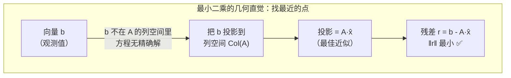

> **第七部分：最小二乘与优化**

## 7.1 最小二乘的本质

**问题**：给定 `Ax = b`（m 个方程，n 个未知数，m > n），通常无精确解。最小二乘求使 `‖Ax - b‖²` 最小的 x。



> **一句话直觉**：`Ax = b` 无解时，不要放弃——在 A 的列空间中找到**离 b 最近**的那个向量作为"最佳近似解"。这个"最近"就是残差向量的长度最小，等价于求**正交投影**。

### 7.1.1 正规方程

```python
# 正规方程：A^T A x = A^T b
x = np.linalg.inv(A.T @ A) @ A.T @ b

# 数值稳定的做法（避免显式求逆）
x, residuals, rank, s = np.linalg.lstsq(A, b, rcond=None)

# 或用 SVD
U, S, Vt = np.linalg.svd(A, full_matrices=False)
S_inv = np.diag(1.0 / S)
x = Vt.T @ S_inv @ U.T @ b
```

### 7.1.2 加权最小二乘

当不同观测的可靠性不同时，给每个残差加权重 w_i：

```python
# 加权最小二乘：min Σ w_i (a_i^T x - b_i)^2
# 矩阵形式：W A x = W b
W = np.diag(weights)
x = np.linalg.lstsq(W @ A, W @ b, rcond=None)[0]
```

## 7.2 在机器人视觉中的应用

### 7.2.1 PnP 中的最小二乘

PnP（Perspective-n-Point）是通过 3D-2D 对应点求相机位姿的问题。其核心是**最小化重投影误差**：

```python
def pnp_dlt(pts_3d, pts_2d, K):
    """
    DLT 方法求解 PnP（线性近似，作为初值）
    pts_3d: (N, 3) 世界坐标系下的 3D 点
    pts_2d: (N, 2) 对应的像素坐标
    K: (3, 3) 内参矩阵
    """
    K_inv = np.linalg.inv(K)
    N = len(pts_3d)
    
    # 构造线性方程组 A·h = 0
    # 每个点贡献 2 行
    A = []
    for i in range(N):
        X, Y, Z = pts_3d[i]
        u, v = pts_2d[i]
        x_n, y_n, _ = K_inv @ np.array([u, v, 1])  # 归一化坐标
        A.append([X, Y, Z, 1, 0, 0, 0, 0, -x_n*X, -x_n*Y, -x_n*Z, -x_n])
        A.append([0, 0, 0, 0, X, Y, Z, 1, -y_n*X, -y_n*Y, -y_n*Z, -y_n])
    A = np.array(A)
    
    # 解最小二乘：SVD 求 A 的零空间（最小奇异值对应的右奇异向量）
    _, _, Vt = np.linalg.svd(A)
    P = Vt[-1, :].reshape(3, 4)  # 3×4 投影矩阵
    
    # 从投影矩阵分解 R, t
    R = P[:3, :3]
    # 确保 R 是正交矩阵（用 SVD 投影到 SO(3)）
    U_R, _, Vt_R = np.linalg.svd(R)
    R_opt = U_R @ Vt_R
    t = P[:3, 3] / np.linalg.norm(P[:3, 3])  # 尺度归一化
    
    return R_opt, t
```

> **注意**：实际 PnP 还用 EPnP、UPnP 等方法，且需要 RANSAC 去除误匹配。

### 7.2.2 相机标定中的最小二乘

张正友标定法的核心是求解**单应矩阵**，本质就是最小二乘问题。

### 7.2.3 BA（光束法平差）中的最小二乘

BA 是 SLAM 后端的核心，它**最小化所有观测的重投影误差之和**：

```python
# BA 的数学形式
# min_{R_i, t_i, P_j} Σ_i Σ_j ‖π(K(R_i·P_j + t_i)) - p_ij‖²
#
# 其中：
# - R_i, t_i：第 i 帧的相机位姿
# - P_j：第 j 个 3D 点
# - p_ij：P_j 在第 i 帧上的观测像素
# - π：投影函数（含畸变）
# - 使用高斯-牛顿或 LM 算法迭代求解
```

---

---

[← 返回 2.1.0 总览与学习路径](2.1.0_总览与学习路径.md)

---

## 📝 测试题

**1. 本质理解** ⭐⭐
最小二乘法的几何本质是什么？为什么说它是在列空间中寻找"最近"的向量？

**2. 概念辨析** ⭐
正规方程 `A^T A x = A^T b` 是怎么推导出来的？什么时候不能直接用正规方程求解？

**3. 代码实践** ⭐⭐
用 DLT 方法实现 PnP 求解：函数 `pnp_dlt(pts_3d, pts_2d, K)`，输入 3D-2D 对应点和内参，输出旋转矩阵 R 和平移向量 t。

**4. 视觉关联** ⭐⭐⭐
BA（光束法平差）最小化的目标函数是什么？写出其数学形式，并解释每个符号的含义。

**5. 原理追问** ⭐⭐
加权最小二乘在什么场景下有用？在视觉 SLAM 中，哪些观测的权重应该设得较低？
