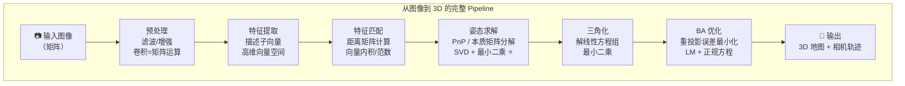

> **第八部分：实战串讲——从图像到 3D 的全链路线性代数**

## 8.1 完整流程

下图展示了一个典型的视觉感知 Pipeline 中，线性代数知识在每一步的应用：



## 8.2 代码实战：从两张图到 3D 变换

```python
import numpy as np

def two_view_reconstruction(kpts1, kpts2, K, matches):
    """
    从两帧匹配点恢复本质矩阵和位姿
    kpts1, kpts2: (N, 2) 两帧的特征点
    K: (3, 3) 内参矩阵
    matches: (M, 2) 匹配对索引
    """
    # 1. 取出匹配点
    pts1 = kpts1[matches[:, 0]]   # (M, 2)
    pts2 = kpts2[matches[:, 1]]   # (M, 2)
    
    # 2. 归一化坐标（去内参）
    K_inv = np.linalg.inv(K)
    pts1_norm = (K_inv @ np.hstack([pts1, np.ones((len(pts1), 1))]).T).T[:, :2]
    pts2_norm = (K_inv @ np.hstack([pts2, np.ones((len(pts2), 1))]).T).T[:, :2]
    
    # 3. 用 8 点法求本质矩阵
    # 构造约束矩阵 A
    x1, y1 = pts1_norm[:, 0], pts1_norm[:, 1]
    x2, y2 = pts2_norm[:, 0], pts2_norm[:, 1]
    A = np.column_stack([
        x2*x1, x2*y1, x2, y2*x1, y2*y1, y2, x1, y1, np.ones_like(x1)
    ])
    _, _, Vt = np.linalg.svd(A)
    E = Vt[-1, :].reshape(3, 3)  # 最小奇异值解
    
    # 4. 强制 E 的奇异值模式为 (σ, σ, 0)
    U, S, Vt = np.linalg.svd(E)
    S_corrected = np.diag([(S[0] + S[1]) / 2, (S[0] + S[1]) / 2, 0])
    E = U @ S_corrected @ Vt
    
    # 5. 从 E 恢复 R, t
    candidates = recover_pose_from_E(E)
    # （实际需要三角化选正深度最多的解，此处简化）
    R, t = candidates[0]
    
    return R, t, E
```

---

## 附录：NumPy 线性代数速查表

```python
# ========== 创建矩阵 ==========
np.array([[1, 2], [3, 4]])              # 手动创建
np.zeros((3, 4))                         # 全零
np.ones((2, 3))                          # 全一
np.eye(3)                                # 单位矩阵
np.random.randn(3, 3)                    # 随机正态

# ========== 矩阵运算 ==========
A @ B                                    # 矩阵乘法
np.linalg.inv(A)                         # 逆
np.linalg.det(A)                         # 行列式
np.linalg.matrix_rank(A)                 # 秩
np.trace(A)                              # 迹
A.T                                       # 转置

# ========== 分解 ==========
np.linalg.eig(A)                         # 特征分解
np.linalg.svd(A)                         # SVD 分解
np.linalg.qr(A)                          # QR 分解
np.linalg.cholesky(A)                    # Cholesky 分解

# ========== 求解 ==========
np.linalg.solve(A, b)                    # 线性方程组 Ax = b
np.linalg.lstsq(A, b, rcond=None)        # 最小二乘
np.linalg.pinv(A)                        # 伪逆

# ========== 范数 ==========
np.linalg.norm(v)                        # L2 范数
np.linalg.norm(v, 1)                     # L1 范数
np.linalg.norm(A, 'fro')                 # Frobenius 范数
```

---

## 知识关联图谱

以下思维导图总结了本专题中所有线性代数概念与机器人视觉应用的关联关系：

```mermaid
mindmap
  root((线性代数与视觉感知))
    向量与向量空间
      内积 → 特征匹配
      外积 → 本质矩阵 [t]_×
      基变换 → 坐标系转换
      范数 → 距离度量
    矩阵运算
      乘法 → 变换复合
      逆 → 反投影/坐标反算
      转置 → 正交矩阵特性
    行列式与秩
      det(R)=1 → 旋转保体积
      秩=2 → 本质矩阵奇异
      秩判定 → 可解性分析
    齐次坐标
      4×4 变换矩阵 → 刚体变换
      相机投影公式 → 3D→2D
      链式变换 → 多坐标系
    SVD 分解 ⭐⭐⭐
      伪逆 → Ax=b 求解
      本质矩阵分解 → 位姿恢复
      ICP 配准 → 点云对齐
      单应分解 → 运动分析
    特征分解
      PCA → 降维/特征压缩
      协方差矩阵 → 数据主方向
    最小二乘
      正规方程 → PnP/标定
      BA 优化 → SLAM 后端
      加权 → 鲁棒估计
```

---

## 总结：必须掌握的线性代数能力清单

| 能力 | 熟练要求 | 验证方式 |
|------|---------|----------|
| 矩阵乘法与维度规则 | 闭眼能算 | 能分析任何视觉算法中的 tensor 形状 |
| 齐次坐标与 4×4 变换矩阵 | 闭眼能写 | 能手写相机投影公式 |
| SVD 分解 | 能手推、手写代码 | 能实现本质矩阵分解、ICP 配准 |
| 最小二乘 | 理解正规方程与伪逆 | 能理解 PnP、BA 的求解原理 |
| 特征分解 | 理解 PCA | 能解释协方差矩阵的特征向量含义 |
| 外积与反对称矩阵 | 闭眼能写 | 能推导本质矩阵公式 |
| 向量空间与基变换 | 理解坐标系本质 | 能手写世界系↔相机系转换 |

> **一句话总结**：线性代数不是一个个孤立的数学概念，而是机器人视觉中**描述空间、变换、度量和优化**的统一语言。每学一个概念，都要在脑海中问——"这个在 SLAM 中出现在哪里？在目标检测中出现在哪里？"

---

[← 返回 2.1.0 总览与学习路径](2.1.0_总览与学习路径.md)
