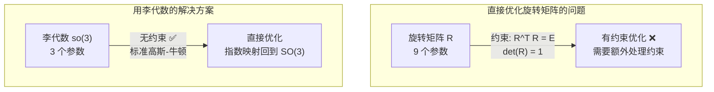

# 2.2 李群与李代数 ⭐⭐

> **与机器人视觉感知的关联**：李群与李代数是 SLAM 和 3D 视觉中**不可回避**的数学工具，也是区分"做 2D CV"和"做机器人 3D 视觉"的知识分水岭。在视觉 SLAM 后端优化（BA）中，直接用旋转矩阵（9 参数）做优化存在**过参数化**问题（需要满足 R^T R = E 约束），而李代数将旋转用 3 个参数表示，转化为**无约束优化**，可用标准高斯-牛顿法求解。

---

## 为什么机器人视觉必须学李群李代数？



| 对比维度 | 旋转矩阵 (SO(3)) | 李代数 (so(3)) |
|---------|-----------------|----------------|
| 参数数量 | 9 个（冗余） | 3 个（紧凑） |
| 约束条件 | R^T R = E, det(R) = 1 | 无约束 |
| 优化难度 | 需要带约束优化（麻烦） | 标准无约束优化 ✅ |
| 几何含义 | 描述旋转的结果 | 描述旋转的**增量** |
| 面试频率 | ⭐⭐ | ⭐⭐⭐ |

## 学习路径

本专题按**递进关系**组织，建议按顺序学习：

```mermaid
mindmap
  root((2.2 李群与李代数))
    群的定义
      群公理
      SO(3) 特殊正交群
      SE(3) 特殊欧氏群
    李代数 so(3)
      旋转向量 ⭐
      反对称矩阵 ↔ 李代数
      指数映射 ⭐⭐⭐
      对数映射
    李代数 se(3)
      六维向量
      指数/对数映射
    扰动模型 ⭐⭐
      BCH 公式
      左乘扰动
      右乘扰动
    伴随矩阵
      SE(3) 伴随性质
      协方差变换
    实战
      Sophus 库
      手写指数映射
      BA 中的扰动应用
```


---

## 掌握程度目标

| 知识点 | 掌握程度 | 说明 |
|--------|---------|------|
| **SO(3) / SE(3)** | ⭐⭐ | 理解旋转矩阵和变换矩阵的群约束 |
| **李代数 so(3)** | ⭐⭐⭐ | **核心**：旋转向量、反对称矩阵 |
| **指数映射与对数映射** | ⭐⭐⭐ | **核心**：Rodriguez 公式，so(3)↔SO(3) 互转 |
| **BCH 公式与扰动模型** | ⭐⭐ | 理解 BA 中增量更新的原理 |
| **李代数 se(3)** | ⭐⭐ | 六维向量、4×4 指数的形式 |
| **伴随矩阵** | ⭐ | 了解协方差变换中的应用 |

---

## 推荐学习资源

| 类型 | 资源 | 用途 |
|------|------|------|
| **教材** | 《视觉 SLAM 十四讲》第 4 讲 | 最通俗的李群李代数入门 |
| **视频** | Eeigen C. — Lie Groups for Computer Vision (YouTube) | 直观的几何解释 |
| **论文** | "A Micro Lie Theory for State Estimation in Robotics" | 机器人领域标准参考 |
| **代码** | Sophus C++ 库 (strasdat/Sophus) | 工业级 SO(3)/SE(3) 实现 |
| **代码** | `scipy.spatial.transform.Rotation` | Python 端旋转操作 |

---

[→ 开始学习：2.2.1 群与李群初步](2.2.1_群与李群初步.md)

---

## 📝 测试题

**1. 本质理解** ⭐⭐
为什么说李群与李代数是"区分做 2D CV 和做 3D 机器人视觉的知识分水岭"？

**2. 概念辨析** ⭐⭐⭐
为什么在 SLAM 后端优化中不能用旋转矩阵直接做优化，而必须用李代数？

**3. 代码实践** ⭐
使用 Sophus C++ 库，写一个代码片段：从旋转向量 (0.3, 0.2, 0.1) 构造 SO(3)，然后通过对数映射取回旋转向量，验证互逆性。

**4. 推荐资源** ⭐
如果你想深入学习李群李代数，推荐哪本书/哪个视频作为入门？理由是什么？
