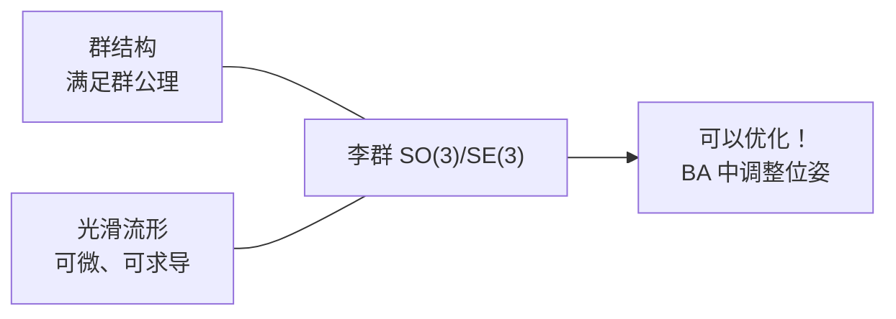

# 2.2.1 群与李群初步

> **机器人视觉定位**：群论为描述**刚体运动**提供了严格的数学框架。在 SLAM 中，相机的位姿（旋转 + 平移）不是普通的向量空间——旋转矩阵有约束（R^T R = E），多个旋转的复合有特定规则。**群**就是用来描述这类带结构的集合的数学工具。

---

## 1. 群的定义

### 1.1 群公理

一个**群**是一个集合 G 加上一个二元运算 `·`，满足以下四个公理：

| 公理 | 定义 | 解释 |
|------|------|------|
| **封闭性** | ∀ a,b ∈ G, a·b ∈ G | 两个群元素运算后仍在群中 |
| **结合律** | (a·b)·c = a·(b·c) | 运算顺序不影响结果 |
| **幺元** | ∃ e ∈ G, e·a = a·e = a | 存在单位元（不变的元素） |
| **逆元** | ∀ a ∈ G, ∃ a⁻¹, a·a⁻¹ = e | 每个元素都有逆 |

```python
# 群公理的直观理解——以整数加法群 (Z, +) 为例
# 集合：所有整数 Z
# 运算：加法 +
# 封闭性：1 + 2 = 3 ∈ Z ✅
# 结合律：(1 + 2) + 3 = 1 + (2 + 3) ✅
# 幺元：0（任何数加 0 不变）
# 逆元：a 的逆是 -a（a + (-a) = 0）
```

### 1.2 为什么机器人视觉需要群？

在机器人视觉中，我们关心的不是任意群，而是**李群**——它既是群又是光滑流形。这意味着群元素可以"平滑变化"，我们能对其做**微分和优化**。

```
普通群（如整数加法群）     → 离散的，不能求导 ❌
李群（如旋转矩阵群 SO(3)） → 连续的，可以求导 ✅ → 可以优化！
```

---

## 2. SO(3)——特殊正交群 ⭐⭐

### 2.1 定义

```
SO(3) = { R ∈ ℝ³ˣ³ | R^T R = E, det(R) = 1 }
```
（特殊正交群，所有 3×3 **旋转矩阵**的集合；`R^T R = E` 保证列向量是单位正交基，`det(R) = 1` 保证是纯旋转而非反射）

### 2.2 验证 SO(3) 满足群公理

| 公理 | 验证 | 解释 |
|------|------|------|
| **封闭性** | R₁·R₂ ∈ SO(3) | 两个旋转复合后仍是合法旋转 |
| **结合律** | (R₁R₂)R₃ = R₁(R₂R₃) | 矩阵乘法天然满足 |
| **幺元** | E（单位矩阵） | 旋转 0 度（不变） |
| **逆元** | R⁻¹ = R^T | 逆旋转 = 转置 |

### 2.3 SO(3) 的几何含义

SO(3) 的每个元素是一个旋转矩阵，描述了三维空间中的一种**朝向**：

```python
import numpy as np

# 绕 Z 轴旋转 30° 的旋转矩阵
theta = np.deg2rad(30)
R = np.array([
    [np.cos(theta), -np.sin(theta), 0],
    [np.sin(theta),  np.cos(theta), 0],
    [0,              0,             1]
])
print(R)
# [[ 0.866, -0.5,   0.],
#  [ 0.5,   0.866,  0.],
#  [ 0.,    0.,     1.]]

# 验证是否属于 SO(3)
assert np.allclose(R.T @ R, np.eye(3))  # R^T R = E
assert np.abs(np.linalg.det(R) - 1.0) < 1e-6  # det(R) = 1
print("✅ 这是一个合法的旋转矩阵")
```

**面试常问**：为什么旋转矩阵的逆就是转置？

> **逐层解析**：已知 `R^T R = E`，这已经直接符合逆矩阵的定义（矩阵乘其逆等于单位阵）。所以 `R^T` 就是 `R` 的左逆。
>
> 由于 R 是方阵且 `det(R) = 1 ≠ 0`，左逆自动等于右逆，因此 `R^T = R⁻¹` 成立。
>
> **几何理解**：逆旋转 = 转置。如果你绕 Z 轴转了 30°，R^T 就是绕 Z 轴转 -30°——把旋转"撤销"。所以求逆旋转不用算复杂的逆矩阵，直接转置即可。

```python
import numpy as np

# 验证：R^T 就是 R 的逆
theta = np.radians(30)
R = np.array([[np.cos(theta), -np.sin(theta), 0],
              [np.sin(theta),  np.cos(theta), 0],
              [0,              0,             1]])

print(np.linalg.inv(R))  # 传统逆矩阵
print(R.T)               # 转置——结果完全一致 ✅
```

---

## 3. SE(3)——特殊欧氏群 ⭐⭐

### 3.1 定义

```
SE(3) = { T = [R t; 0 1] ∈ ℝ⁴ˣ⁴ | R ∈ SO(3), t ∈ ℝ³ }
```
（特殊欧氏群，所有 4×4 **刚体变换矩阵**的集合；`R` 是旋转矩阵，`t` 是平移向量）

```python
def make_SE3(R, t):
    """构造 SE(3) 变换矩阵"""
    T = np.eye(4)
    T[:3, :3] = R          # 旋转部分
    T[:3, 3]  = t          # 平移部分
    return T

# 验证 T 是否在 SE(3) 中
R = np.eye(3)  # 单位旋转
t = np.array([1.0, 2.0, 3.0])
T = make_SE3(R, t)
print(T)
# [[1, 0, 0, 1],
#  [0, 1, 0, 2],
#  [0, 0, 1, 3],
#  [0, 0, 0, 1]]
```

### 3.2 SE(3) 的群性质

| 性质 | 公式 | 含义 |
|------|------|------|
| **封闭性** | T₁·T₂ ∈ SE(3) | 两个变换的复合仍是刚体变换 |
| **幺元** | E₄（4×4 单位矩阵） | 不变换 |
| **逆元** | T⁻¹ = [R^T, -R^T t; 0, 1] | 反向变换 |
| **结合律** | (T₁T₂)T₃ = T₁(T₂T₃) | 矩阵乘法满足 |

### 3.3 SE(3) 的链式变换

SE(3) 最重要的应用是**坐标系链式变换**：

```python
# 世界坐标系 → 机器人基座 → 相机 → 目标
T_wc = T_wb @ T_bc @ T_co
# T_wc: 世界系 → 相机系（从右往左读）
```

---

## 4. SO(3) 与 SE(3) 的对比

| 对比项 | SO(3) | SE(3) |
|--------|-------|-------|
| **描述** | 纯旋转（朝向） | 旋转 + 平移（位姿） |
| **矩阵大小** | 3×3 | 4×4 |
| **自由度** | 3 | 6 |
| **约束** | R^T R = E, det = 1 | 左上 3×3 是 SO(3) |
| **机器人视觉用途** | 相机朝向、IMU 姿态 | 相机位姿、机器人定位 |

---

## 5. 李群的直观理解

"李群" = "群" + "光滑流形"



**为什么光滑性（可微）这么重要？**

在 BA 优化中，我们需要对相机位姿做**微小调整**来最小化重投影误差。如果位姿只是群（离散的），我们无法求导。但李群是光滑的，我们可以定义**切线空间**（李代数），在切线上做优化，再映射回群。这就是下一节的内容。

---

## 必须掌握的核心要点

1. **群公理**：封闭性、结合律、幺元、逆元——能验证 SO(3) 和 SE(3) 是群
2. **旋转矩阵约束**：R^T R = E, det(R) = 1（面试必问）
3. **SE(3) 逆的快速计算**：R⁻¹ = R^T, T⁻¹ 的快速公式
4. **链式变换**：T_wc = T_wb @ T_bc 的含义（从右往左读）
5. **李群 vs 普通群**：李群是光滑的，可以求导和优化

---

[← 返回 2.2.0 总览与学习路径](2.2.0_总览与学习路径.md)
