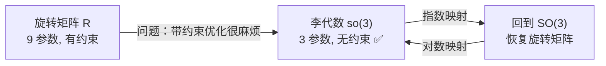
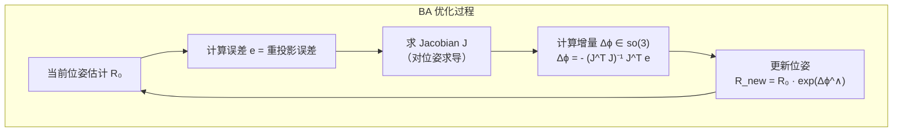

# 2.2.2 李代数 so(3) ⭐⭐⭐

> **机器人视觉定位**：上一节我们知道 SO(3) 是旋转矩阵的集合。但有一个棘手的问题——**旋转矩阵有 9 个参数却只有 3 个自由度**，做优化时约束 R^T R = E 很难处理。李代数 so(3) 的诞生就是为了解决这个问题：它用**无约束的 3 参数**表示旋转，是 SLAM 后端优化中的核心工具。

---

## 1. 为什么要引入李代数？



| 对比 | SO(3) | so(3) |
|------|-------|-------|
| 参数数量 | 9（冗余） | **3（紧凑）** |
| 约束 | R^T R = E, det = 1 | **无约束** |
| 优化方式 | 带约束优化（难） | **标准无约束优化** ✅ |
| 几何含义 | 旋转的"结果" | 旋转的"速度/增量" |

---

## 2. 李代数 so(3) 的定义

### 2.1 旋转向量（轴角）

最简单的理解：so(3) 中的元素就是**旋转向量**——用一个 3D 向量 `ϕ` 表示旋转：

```
ϕ = θ · n
```
（旋转向量，轴角表示法；`n` 是单位旋转轴，`θ` 是绕该轴的旋转角度，单位为弧度）
- `n`：单位向量，表示旋转轴
- `θ`：标量，表示绕该轴旋转的角度
- `ϕ`：旋转向量，方向为轴，模长为角度

```python
import numpy as np

# 示例：绕 x 轴旋转 45°
theta = np.deg2rad(45)
n = np.array([1.0, 0.0, 0.0])  # 绕 x 轴
phi = theta * n                 # 旋转向量
print(f"旋转向量: {phi}")       # [0.785, 0, 0]
```

### 2.2 形式化定义

so(3) 是 3×3 **反对称矩阵**的集合：

```
so(3) = { Φ = ϕ^∧ ∈ ℝ³ˣ³ | ϕ ∈ ℝ³ }
```
（李代数 so(3)，是所有 3×3 **反对称矩阵**的集合；`ϕ` 是旋转向量，`ϕ^∧` 是 `ϕ` 对应的反对称矩阵）

```python
def hat(v):
    """wedge 操作：向量 → 反对称矩阵"""
    return np.array([
        [0,    -v[2],  v[1]],
        [v[2],  0,    -v[0]],
        [-v[1], v[0],  0   ]
    ])

def vee(Phi):
    """vee 操作：反对称矩阵 → 向量"""
    return np.array([Phi[2,1], Phi[0,2], Phi[1,0]])

# 验证
phi = np.array([1, 2, 3])
Phi = hat(phi)
phi_back = vee(Phi)
assert np.allclose(phi, phi_back)  # 来回转换一致
print("wedge ↔ vee 互逆 ✅")
```

### 2.3 so(3) 是向量空间

so(3) 构成一个向量空间——可以对元素做**加法和数乘**：

```python
# so(3) 的加法（对应旋转向量的加法）
phi1 = np.array([0.1, 0.2, 0.3])
phi2 = np.array([0.4, 0.5, 0.6])
phi_sum = phi1 + phi2  # 在 so(3) 中就是向量加法

# 但注意：so(3) 中的加法 ≠ SO(3) 中旋转的复合！
# R(phi1 + phi2) ≠ R(phi1) · R(phi2)  —— 这一点非常重要
```

---

## 3. so(3) 与旋转矩阵的关系

so(3) 和 SO(3) 通过**指数映射**和**对数映射**相互转换：

```
so(3) (旋转向量)  ←指数映射→  SO(3) (旋转矩阵)
        ←对数映射→
```

### 3.1 指数映射：从 so(3) 到 SO(3)

给定旋转向量 `ϕ = θ·n`，对应的旋转矩阵为（Rodriguez 公式）：

```
R = exp(ϕ^∧) = E + sinθ · n^∧ + (1 - cosθ) · (n^∧)²
```

```python
def exp_so3(phi):
    """指数映射：旋转向量 → 旋转矩阵 (Rodriguez 公式)"""
    theta = np.linalg.norm(phi)
    if theta < 1e-10:
        return np.eye(3)
    n = phi / theta
    n_hat = hat(n)
    R = np.eye(3) + np.sin(theta) * n_hat + (1 - np.cos(theta)) * (n_hat @ n_hat)
    return R

# 验证
phi = np.array([0.5, 0.2, 0.3])
R = exp_so3(phi)
assert np.allclose(R.T @ R, np.eye(3))  # SO(3) 约束
assert np.abs(np.linalg.det(R) - 1.0) < 1e-6
print(f"旋转矩阵:\n{R}")
```

### 3.2 对数映射：从 SO(3) 到 so(3)

给定旋转矩阵 R，提取旋转向量 `ϕ`：

```
θ = arccos((tr(R) - 1) / 2)
n = (R - R^T)∨ / (2 sinθ)
ϕ = θ · n
```

```python
def log_so3(R):
    """对数映射：旋转矩阵 → 旋转向量"""
    theta = np.arccos(np.clip((np.trace(R) - 1) / 2, -1, 1))
    if theta < 1e-10:
        return np.zeros(3)
    n_hat = (R - R.T) / (2 * np.sin(theta))
    n = vee(n_hat)
    return theta * n

# 验证互逆性
phi_original = np.array([0.5, 0.2, 0.3])
R = exp_so3(phi_original)
phi_recovered = log_so3(R)
assert np.allclose(phi_original, phi_recovered)
print(f"原始: {phi_original}")
print(f"恢复: {phi_recovered}")
print("指数映射 ↔ 对数映射 互逆 ✅")
```

---

## 4. so(3) 在 SLAM 中的核心作用

### 4.1 为什么优化要用 so(3) 而不是 SO(3)？



**关键**：增量 Δϕ 是在 so(3) 中的（3 个参数，无约束），用标准最小二乘求解；然后通过指数映射变回 SO(3) 更新旋转矩阵。

### 4.2 面试核心问题

> **问**：为什么要用李代数表示位姿而不是直接优化旋转矩阵？

```
答：
1. 旋转矩阵 9 参数，但自由度只有 3，有 R^T R = E 约束
   → 带约束优化困难
2. 李代数用 3 参数无约束表示旋转的"增量"
   → 可用标准高斯-牛顿/ LM 求解
3. 优化得到的增量 Δϕ 通过指数映射回到 SO(3)
   → 保证了更新后的 R 仍在流形上（自动满足约束）
```

---

## 必须掌握的核心要点

1. **旋转向量**：ϕ = θ·n，方向是轴，模长是角度
2. **wedge/vee 操作**：向量 ↔ 反对称矩阵的互转
3. **Rodriguez 公式**：必须能手写 `R = E + sinθ·n^∧ + (1-cosθ)·(n^∧)²`
4. **指数/对数映射互逆**：exp(log(R)) = R, log(exp(ϕ)) = ϕ
5. **为什么用 so(3) 优化**：无约束 3 参数，增量通过指数映射回到 SO(3)

---

[← 返回 2.2.0 总览与学习路径](2.2.0_总览与学习路径.md)
