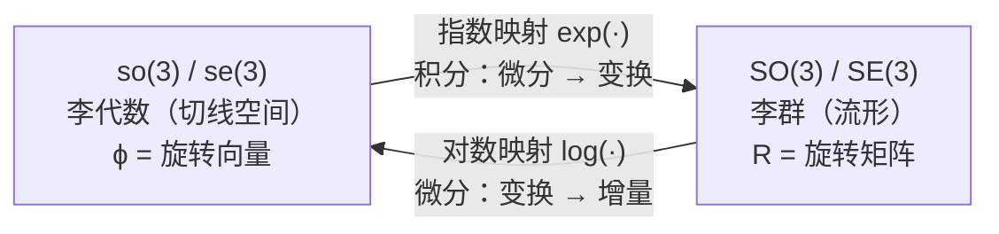
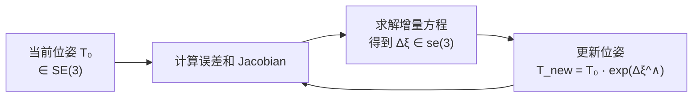

# 2.2.3 指数映射与对数映射 ⭐⭐⭐

> **机器人视觉定位**：指数映射和对数映射是连接**李代数（微分量）**和**李群（积分量）**的桥梁。在 SLAM 后端 BA 优化中，我们在李代数上计算增量，然后用指数映射将增量"积分"到位姿上。这两个映射的理解程度直接决定了你是否真正理解了李群李代数。

---

## 1. 核心直觉



**一句话直觉**：指数映射 = "从切空间到流形的积分"，对数映射 = "从流形到切空间的微分"。

就像速度积分得到位移一样：速度（李代数）→ 积分 → 位置（李群），位置（李群）→ 微分 → 速度（李代数）。

---

## 2. so(3) 的指数映射（Rodriguez 公式）⭐⭐⭐

### 2.1 公式推导

对于旋转向量 `ϕ = θ·n`（旋转向量，轴角表示法；`θ` 是绕轴 `n` 的旋转弧度），指数映射的闭式解为：

```
R = exp(ϕ^∧) = cosθ · E + (1 - cosθ) · n·n^T + sinθ · n^∧
```

等价形式（更常用的版本）：

```
R = E + sinθ · n^∧ + (1 - cosθ) · (n^∧)²
```

```python
import numpy as np

def hat(v):
    return np.array([[0, -v[2], v[1]],
                     [v[2], 0, -v[0]],
                     [-v[1], v[0], 0]])

def exp_so3(phi):
    """
    Rodriguez 公式：旋转向量 → 旋转矩阵
    phi: (3,) 旋转向量
    """
    theta = np.linalg.norm(phi)
    if theta < 1e-10:
        return np.eye(3)  # 零旋转
    n = phi / theta
    n_hat = hat(n)
    R = (np.eye(3) 
         + np.sin(theta) * n_hat 
         + (1 - np.cos(theta)) * (n_hat @ n_hat))
    return R

# 验证：绕 Z 轴转 90°
phi = np.array([0, 0, np.pi/2])
R = exp_so3(phi)
print(f"绕 Z 轴转 90°:\n{R}")
# 期望结果：
# [[0, -1, 0],
#  [1,  0, 0],
#  [0,  0, 1]]
```

### 2.2 小角度近似

当 θ → 0（微小旋转）时，Rodriguez 公式可近似为：

```
R ≈ E + ϕ^∧
```

这解释了为什么**微小旋转可以用旋转向量直接表示**——这也正是 BA 优化中增量更新的基础。

```python
# 小角度近似验证
phi_small = np.array([0.001, 0.002, 0.003])
R_exact = exp_so3(phi_small)
R_approx = np.eye(3) + hat(phi_small)

print(f"精确值 - 对角线: {np.diag(R_exact)}")
print(f"近似值 - 对角线: {np.diag(R_approx)}")
# 小角度下，两者非常接近
```

---

## 3. so(3) 的对数映射

### 3.1 公式推导

给定旋转矩阵 R，提取旋转向量 ϕ：

```
θ = arccos((tr(R) - 1) / 2)     → 旋转角度
n^∧ = (R - R^T) / (2 sinθ)      → 旋转轴（的反对称矩阵）
ϕ = θ · n                        → 旋转向量
```

```python
def log_so3(R):
    """对数映射：旋转矩阵 → 旋转向量"""
    theta = np.arccos(np.clip((np.trace(R) - 1) / 2, -1.0, 1.0))
    
    if theta < 1e-10:      # 零旋转
        return np.zeros(3)
    if np.abs(theta - np.pi) < 1e-10:  # 180° 特殊情况
        # 需要特殊处理（求对称矩阵的特征向量）
        # 此处简化，实际需处理
        return np.array([np.pi, 0, 0])
    
    n_hat = (R - R.T) / (2 * np.sin(theta))
    n = np.array([n_hat[2, 1], n_hat[0, 2], n_hat[1, 0]])
    return theta * n
```

### 3.2 互逆性验证

```python
# 随机测试指数映射 ↔ 对数映射的互逆性
for _ in range(100):
    # 随机生成旋转向量
    phi_random = np.random.randn(3) * 2.0  # 随机角度
    R = exp_so3(phi_random)
    phi_back = log_so3(R)
    
    # 验证：回到原旋转向量（模长正则化）
    phi_random_norm = phi_random / np.linalg.norm(phi_random) * (np.linalg.norm(phi_random) % (2*np.pi))
    assert np.allclose(phi_back, phi_random_norm, atol=1e-6), "互逆性失败"
print("指数映射 ↔ 对数映射 互逆 ✅")
```

---

## 4. se(3) 的指数映射

### 4.1 公式

se(3) 中的元素是六维向量 `ξ = [ρ, ϕ]^T`（se(3) 六维向量；`ρ` 是平移增量分量，`ϕ` 是旋转增量分量），其中：
- `ϕ`：旋转分量（so(3)）
- `ρ`：平移分量

指数映射从 se(3) 到 SE(3)：

```
exp(ξ^∧) = [R, t; 0, 1]
```
（se(3) → SE(3) 的指数映射；`R` 是旋转矩阵，`t` 是平移向量）
```
R = exp(ϕ^∧)                                          （Rodriguez 公式）
t = (E - exp(ϕ^∧)) · ϕ^∧ · ρ + (n·ρ) · n · θ         （平移部分的闭式解）
```

```python
def exp_se3(xi):
    """
    指数映射：se(3) → SE(3)
    xi: (6,) 其中前 3 维是 ρ（平移），后 3 维是 ϕ（旋转）
    """
    rho, phi = xi[:3], xi[3:]
    R = exp_so3(phi)
    
    theta = np.linalg.norm(phi)
    if theta < 1e-10:
        # 纯平移
        T = np.eye(4)
        T[:3, :3] = R
        T[:3, 3] = rho
        return T
    
    n = phi / theta
    n_hat = hat(n)
    
    # V 矩阵（平移部分的 Jacobian）
    V = (np.eye(3) 
         + (1 - np.cos(theta)) / theta * n_hat 
         + (theta - np.sin(theta)) / theta * (n_hat @ n_hat))
    
    t = V @ rho
    
    T = np.eye(4)
    T[:3, :3] = R
    T[:3, 3] = t
    return T
```

---

## 5. 在 SLAM 中的实际应用

### 5.1 BA 优化中的增量更新

这是指数映射在 SLAM 中最核心的应用：



```python
def update_pose(T_current, delta_xi):
    """
    BA 优化中的位姿更新
    T_current: (4,4) 当前位姿
    delta_xi: (6,) 增量（在 se(3) 中）
    return: (4,4) 更新后的位姿
    """
    delta_T = exp_se3(delta_xi)   # 指数映射：se(3) → SE(3)
    T_new = T_current @ delta_T   # 左乘更新（右乘也可，习惯不同）
    return T_new
```

### 5.2 左乘 vs 右乘扰动

在 SLAM 中，有两种常见的增量更新方式：

| 方式 | 公式 | 使用场景 |
|------|------|----------|
| **左乘扰动** | T_new = exp(Δξ^∧) · T₀ | 全局坐标系的位姿更新 |
| **右乘扰动** | T_new = T₀ · exp(Δξ^∧) | 局部坐标系的位姿更新 |

```python
# 左乘扰动（全局）
T_new_left = exp_se3(delta_xi) @ T_current

# 右乘扰动（局部）
T_new_right = T_current @ exp_se3(delta_xi)
```

---

## 必须掌握的核心要点

1. **Rodriguez 公式**：`R = E + sinθ·n^∧ + (1-cosθ)·(n^∧)²` —— 必须能手写
2. **小角度近似**：`R ≈ E + ϕ^∧`（BA 增量更新的理论基础）
3. **对数映射**：`θ = arccos((tr(R)-1)/2)` 提取旋转角度
4. **se(3) 指数映射**：旋转部分用 Rodriguez，平移部分用 V 矩阵
5. **左乘 vs 右乘**：对应的 Jacobian 形式不同，面试常问

---

[← 返回 2.2.0 总览与学习路径](2.2.0_总览与学习路径.md)
