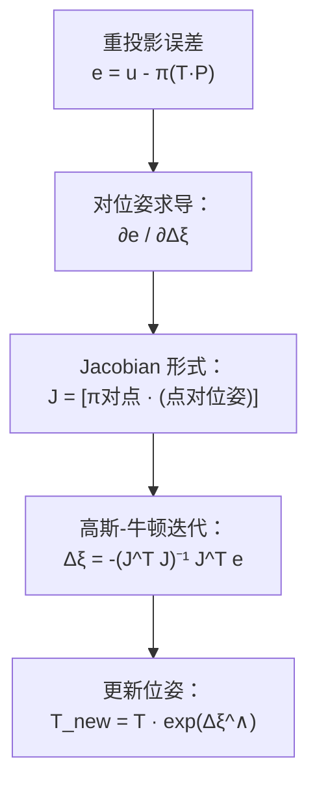

# 2.2.4 扰动模型与 BCH 公式 ⭐⭐

> **机器人视觉定位**：在 SLAM 后端 BA 优化中，我们需要知道"位姿改变一个小量时，误差会怎么变化"——这就是 **Jacobian 矩阵**。BCH 公式告诉我们：当我们在 SO(3) 或 SE(3) 上左乘/右乘一个微小扰动时，对应的李代数如何变化。这是 BA 优化中**导数计算**的理论基础。

---

## 1. 核心问题

在 SO(3) 中，旋转的复合是矩阵乘法：

```
R₁ · R₂ ∈ SO(3)
```

但对应的李代数不是简单的加法：

```
exp(ϕ₁^∧) · exp(ϕ₂^∧) ≠ exp((ϕ₁ + ϕ₂)^∧)   ❌
```

**问题**：当我们在 SO(3) 上施加一个小扰动 ΔR，对应的 so(3) 增量 Δϕ 怎么算？

---

## 2. BCH 公式

### 2.1 SO(3) 上的 BCH 近似

BCH 公式给出了两个李代数指数乘积的近似表达式：

```
ln(exp(ϕ₁^∧) · exp(ϕ₂^∧))^∨ ≈ 
    ϕ₁ + ϕ₂ + (1/2) · (ϕ₁ × ϕ₂) + (1/12) · (ϕ₁ × (ϕ₁ × ϕ₂)) + ...
```

当其中一个量是**小量**时（优化中的常见情况），可以简化。

### 2.2 左乘扰动的 BCH 近似

假设 ϕ₁ 是小量 Δϕ，ϕ₂ 是任意 ϕ：

```
ln(exp(Δϕ^∧) · exp(ϕ^∧))^∨ ≈ 
    J_l(ϕ)⁻¹ · Δϕ + ϕ
```

其中 `J_l` 是 **左 Jacobian**（也叫左扰动 Jacobian）：

```
J_l(ϕ) = sinθ/θ · E + (1 - sinθ/θ) · n·n^T + (1 - cosθ)/θ · n^∧
```

```python
def left_jacobian(phi):
    """左 Jacobian J_l(ϕ)"""
    theta = np.linalg.norm(phi)
    if theta < 1e-10:
        return np.eye(3)
    n = phi / theta
    n_hat = hat(n)
    
    J = (np.sin(theta) / theta * np.eye(3) 
         + (1 - np.sin(theta) / theta) * np.outer(n, n) 
         + (1 - np.cos(theta)) / theta * n_hat)
    return J

def inv_left_jacobian(phi):
    """左 Jacobian 的逆 J_l(ϕ)⁻¹"""
    theta = np.linalg.norm(phi)
    if theta < 1e-10:
        return np.eye(3)
    n = phi / theta
    n_hat = hat(n)
    
    J_inv = (theta / 2 * np.eye(3) 
             / np.tan(theta / 2) * np.eye(3) 
             - (1 - theta / 2 / np.tan(theta / 2)) * np.outer(n, n)
             - theta / 2 * n_hat)  # 简化形式
    return J_inv  # 实际应用中使用数值更稳定的形式
```

### 2.3 右乘扰动的 BCH 近似

右乘时的形式类似，使用**右 Jacobian**：

```
ln(exp(ϕ^∧) · exp(Δϕ^∧))^∨ ≈ 
    J_r(ϕ)⁻¹ · Δϕ + ϕ
```

其中 `J_r(ϕ) = J_l(-ϕ)`。

---

## 3. 扰动模型 ⭐⭐

### 3.1 为什么需要扰动模型？

在 BA 优化中，我们需要求**误差 e 关于位姿 R 的导数**。但 R 是矩阵，直接对矩阵求导不方便。扰动模型的方法是：给 R 左乘/右乘一个微小扰动 ΔR，然后看误差的变化，从而得到 **Jacobian 矩阵**。

### 3.2 左乘扰动模型（最常用）

```
∂(R · p) / ∂Δϕ = -R · p^∧        （对 3D 点 p 旋转后的结果求导）
```

```python
def jacobian_rotation_point(R, p):
    """
    计算 ∂(R·p) / ∂Δϕ
    即：R 左乘微小扰动 ΔR = exp(Δϕ^∧) 后，R·p 对 Δϕ 的导数
    """
    # 结果：-(R·p)^∧
    Rp = R @ p
    return -hat(Rp)

# 验证：数值微分
def numerical_jacobian(R, p, eps=1e-6):
    """数值法验证 Jacobian"""
    J_num = np.zeros((3, 3))
    for i in range(3):
        dphi = np.zeros(3)
        dphi[i] = eps
        R_plus = exp_so3(dphi) @ R
        R_minus = exp_so3(-dphi) @ R
        J_num[:, i] = ((R_plus @ p - R_minus @ p) / (2 * eps))
    return J_num

# 随机测试
R = exp_so3(np.array([0.3, 0.2, 0.1]))
p = np.array([1.0, 0.0, 0.0])
J_analytic = jacobian_rotation_point(R, p)
J_numerical = numerical_jacobian(R, p)
assert np.allclose(J_analytic, J_numerical, atol=1e-6)
print("Jacobian 解析解与数值解一致 ✅")
```

### 3.3 在 BA 中的应用



BA 中的 Jacobian 由两部分组成：

```
∂e / ∂Δξ = (∂e / ∂P') · (∂P' / ∂Δξ)
```

其中：
- `∂e / ∂P'`：重投影误差对 3D 点的导数（相机投影模型的导数）
- `∂P' / ∂Δξ`：3D 点对位姿扰动的导数（扰动模型的导数）

```python
def ba_jacobian(T, P, K):
    """
    BA 中重投影误差对 se(3) 扰动的 Jacobian
    T: (4,4) 当前位姿
    P: (3,) 世界坐标系下的 3D 点
    K: (3,3) 内参矩阵
    """
    # 变换到相机坐标系
    P_c = T[:3, :3] @ P + T[:3, 3]
    X, Y, Z = P_c
    
    # 重投影误差对相机坐标系点的导数 ∂e/∂P' (2×3)
    fx, fy = K[0, 0], K[1, 1]
    de_dPc = np.array([
        [fx/Z, 0, -fx*X/(Z*Z)],
        [0, fy/Z, -fy*Y/(Z*Z)]
    ])
    
    # 相机系点对 se(3) 扰动的导数 ∂P'/∂Δξ (3×6)
    # [ E, -P_c^∧ ]  —— 这是扰动模型的关键结果
    dPc_dxi = np.hstack([np.eye(3), -hat(P_c)])
    
    # 链式法则
    J = de_dPc @ dPc_dxi  # (2×6)
    return J
```

---

## 4. 面试高频问题与解答

### Q1: BCH 公式在 SLAM 中的作用是什么？

> 在 BA 优化中，我们在李代数上计算增量 Δξ，然后需要将增量"叠加"到当前位姿上。BCH 公式告诉我们，当 Δξ 很小时，可以用线性近似 `J⁻¹·Δξ` 来近似这个叠加过程。

### Q2: 左乘扰动和右乘扰动有什么区别？什么时候用哪个？

| 方式 | 公式 | Jacobian | 使用场景 |
|------|------|----------|----------|
| **左乘扰动** | T_new = exp(Δξ)·T | ∂e/∂Δξ_左 | 全局坐标系下的优化（最常用） |
| **右乘扰动** | T_new = T·exp(Δξ) | ∂e/∂Δξ_右 | 局部坐标系下的优化（如 IMU） |

> 左乘更符合"在世界坐标系中调整位姿"的直觉，是视觉 SLAM 中最常用的选择。

### Q3: 为什么微小扰动下 BCH 可以近似为线性？

> 当 Δϕ → 0 时，`exp(Δϕ^∧) ≈ E + Δϕ^∧`（小角度近似），且 J_l(ϕ)·Δϕ ≈ Δϕ。所以 `ln(exp(Δϕ^∧)·exp(ϕ^∧)) ≈ ϕ + J_l⁻¹·Δϕ`，这就是线性近似的来源。

---

## 必须掌握的核心要点

1. **BCH 公式的直觉**：SO(3) 乘法 ≠ so(3) 加法，需要 BCH 来近似
2. **左 Jacobian J_l(ϕ)**：知道其形式和作用，不要求背下完整公式，但要理解
3. **扰动模型的核心公式**：`∂(R·p)/∂Δϕ = -(R·p)^∧`（面试高频手推）
4. **BA Jacobian 的链式法则**：`∂e/∂Δξ = (∂e/∂P') · (∂P'/∂Δξ)`
5. **左乘 vs 右乘**：理解区别，左乘更常见

---

[← 返回 2.2.0 总览与学习路径](2.2.0_总览与学习路径.md)
